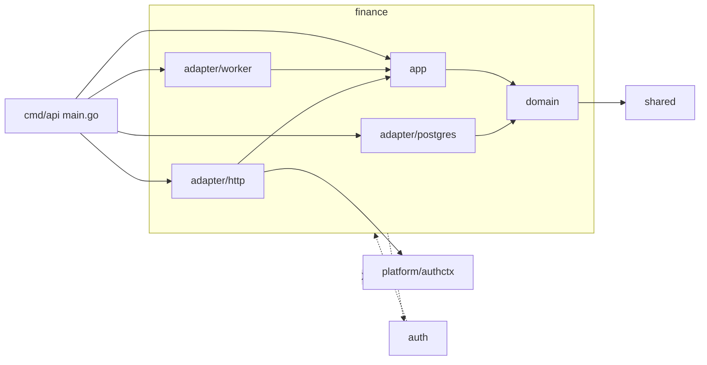
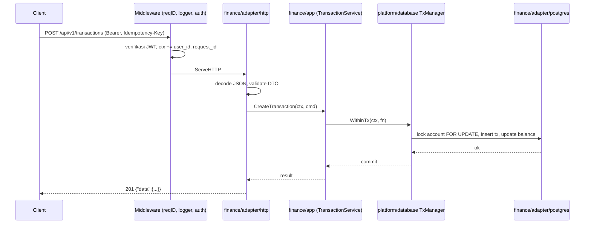
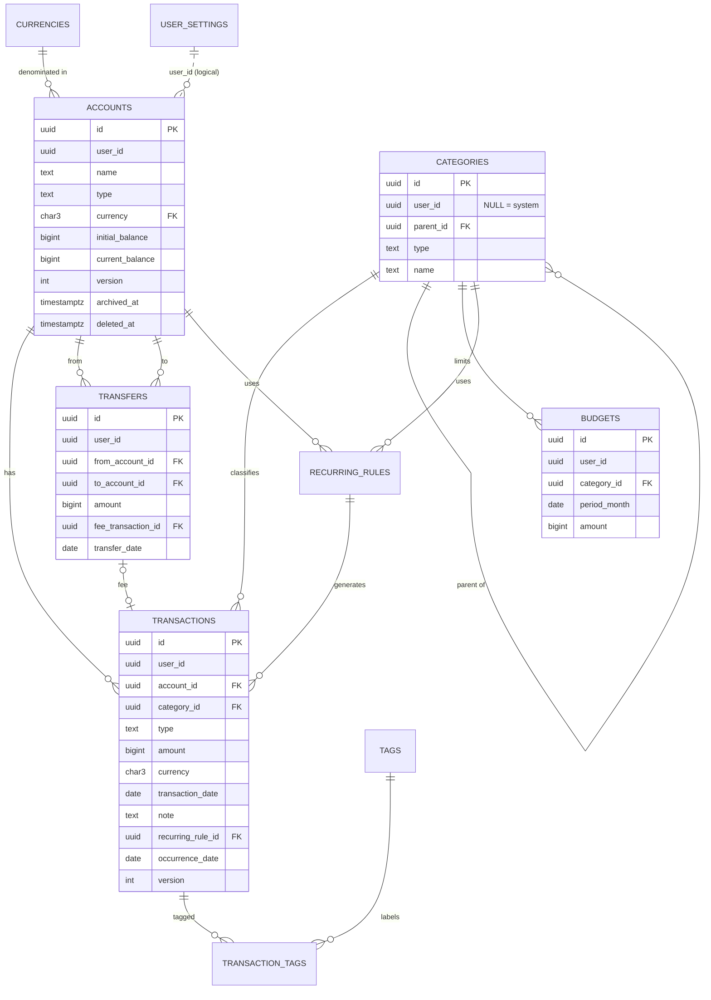
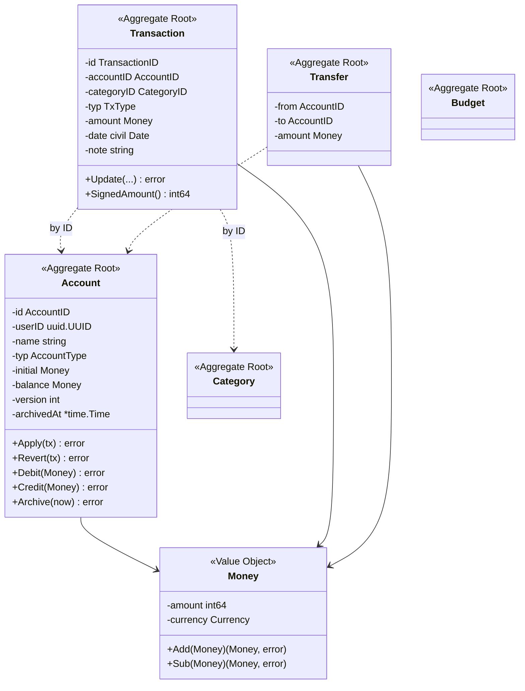
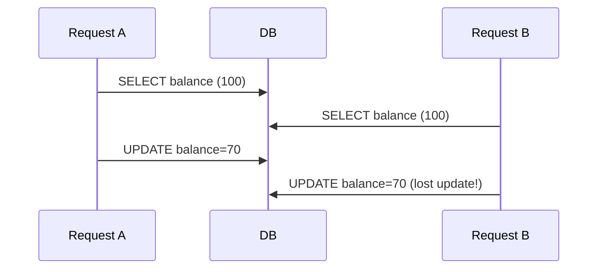
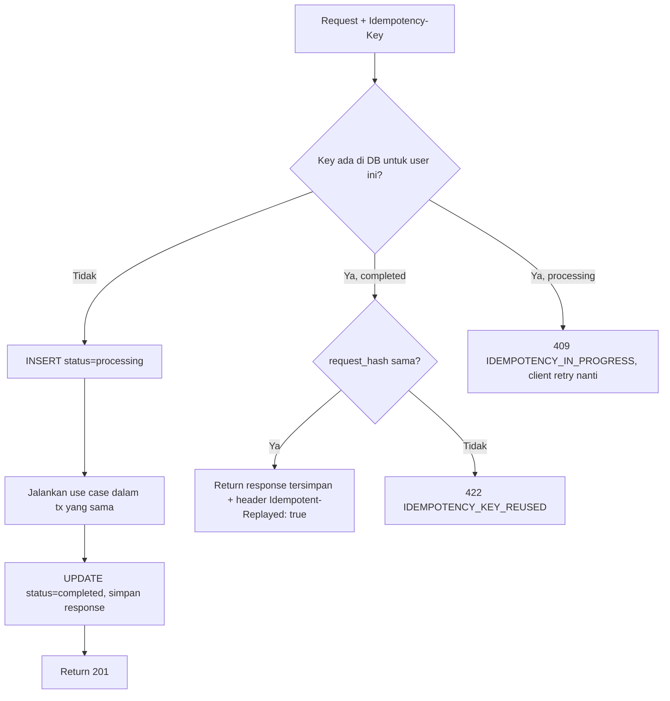
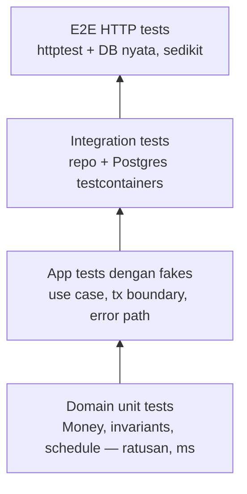
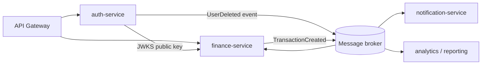

# PRD-02 — Finance Module (Personal Finance Tracker)

> **Status:** Draft v1.0 · **Owner:** Ilham · **Tanggal:** 2026-10-01
> **Prasyarat:** PRD-01 Auth (users, sessions, JWT access token dengan `sub` = `user_id` UUID, middleware yang menaruh `user_id` ke `context.Context`).
> **Bahasa:** Bahasa Indonesia, istilah teknis tetap English.
> **Tujuan dokumen:** PRD sekaligus *learning guide*. Modul ini adalah kendaraan untuk belajar **DDD** (aggregate, value object, invariant, domain event), **transaksi database & concurrency**, **idempotency**, dan **reporting SQL** di Go 1.26.

---

## Daftar Isi

1. [Tujuan, Non-Goals, dan Konteks](#1-tujuan-non-goals-dan-konteks)
2. [Glossary — Ubiquitous Language](#2-glossary--ubiquitous-language)
3. [Arsitektur & Batas Bounded Context](#3-arsitektur--batas-bounded-context)
4. [Fitur & Prioritas (MVP / P1 / P2)](#4-fitur--prioritas-mvp--p1--p2)
5. [Desain Data: ERD, DDL PostgreSQL, dbdiagram.io](#5-desain-data-erd-ddl-postgresql-dbdiagramio)
6. [Domain Model di Go](#6-domain-model-di-go)
7. [API Contract (REST) + Sketsa gRPC](#7-api-contract-rest--sketsa-grpc)
8. [Transaksi Database & Concurrency](#8-transaksi-database--concurrency)
9. [Idempotency](#9-idempotency)
10. [Reporting Queries](#10-reporting-queries)
11. [Testing Strategy](#11-testing-strategy)
12. [Logging & Observability](#12-logging--observability)
13. [Milestones (Sprint)](#13-milestones-sprint)
14. [Jebakan Umum Aplikasi Keuangan](#14-jebakan-umum-aplikasi-keuangan)
15. [Future Roadmap](#15-future-roadmap)
16. [Lampiran: Checklist Review](#16-lampiran-checklist-review)

---

## 1. Tujuan, Non-Goals, dan Konteks

### 1.1 Problem statement
Pengguna ingin mencatat uang masuk (income), uang keluar (expense), dan perpindahan uang antar dompet (transfer) dengan cepat, lalu melihat ringkasan: "saldo saya berapa?", "bulan ini boros di kategori apa?", "apakah budget makan sudah lewat?".

### 1.2 Tujuan produk
| # | Tujuan | Metrik keberhasilan |
|---|--------|---------------------|
| G1 | Mencatat transaksi income/expense < 10 detik | p95 latency `POST /transactions` < 150 ms |
| G2 | Saldo akun selalu benar | 0 selisih pada job rekonsiliasi harian |
| G3 | Tidak ada transaksi ganda saat retry | Idempotency-Key wajib di client, 0 duplikat |
| G4 | Dashboard bulanan akurat sesuai timezone user | Batas bulan sesuai `user_settings.timezone` |
| G5 | Data antar user terisolasi 100% | Semua query ter-scope `user_id`, test IDOR lulus |

### 1.3 Tujuan belajar (learning goals)
- Memodelkan **aggregate** (Account, Transaction, Transfer, Budget) dan **value object** (Money, Currency, DateRange).
- Menegakkan **invariant** di constructor, bukan di handler.
- Menentukan **transaction boundary** di app layer dengan `TxManager`.
- Menangani **concurrency**: `SELECT ... FOR UPDATE`, atomic `UPDATE`, optimistic locking (`version`).
- **Idempotency** untuk operasi tulis yang tidak aman di-retry.
- **Cursor pagination**, query agregasi dengan timezone, indexing.
- **Domain events** dan pola **outbox** (persiapan event-driven).
- Logging terstruktur dengan `log/slog` (request_id, user_id, tanpa membocorkan data sensitif).

### 1.4 Non-goals (sengaja TIDAK dikerjakan)
- Bukan aplikasi akuntansi double-entry penuh (general ledger, chart of accounts, jurnal debit/kredit). Kita pakai *single-entry* + transfer dua kaki. (Dibahas sebagai opsi di roadmap.)
- Tidak ada integrasi bank otomatis (open banking / scraping mutasi).
- Tidak ada investasi/saham/crypto, pajak, payroll.
- Tidak ada pemrosesan pembayaran nyata (tidak memindahkan uang sungguhan).
- Multi-currency dengan kurs real-time baru di P2; MVP = satu *base currency* per user, tapi skema sudah menyimpan `currency` per akun.
- Frontend tidak dibahas detail (hanya pertimbangan API).

### 1.5 Asumsi
- User sudah terautentikasi; finance hanya menerima `userID uuid.UUID` dari context.
- Satu user = satu tenant (shared wallet multi-user baru di P2).
- PostgreSQL 16+ sebagai satu-satunya storage MVP.

---

## 2. Glossary — Ubiquitous Language

> **Ubiquitous language** = kosakata yang sama dipakai di percakapan, kode, nama tabel, dan API. Kalau di diskusi kita bilang "Account", jangan di kode jadi `Wallet` dan di tabel jadi `pockets`.

| Istilah (kode) | Bahasa Indonesia | Definisi |
|----------------|------------------|----------|
| **Account** | Akun / Dompet | Wadah uang milik user: `cash`, `bank`, `ewallet`, `credit_card`. Punya currency dan saldo. (Di UI boleh disebut "Wallet", di kode tetap `Account`.) |
| **Initial Balance** | Saldo awal | Saldo saat akun dibuat. Disimpan sebagai field, bukan sebagai transaksi palsu. |
| **Balance** | Saldo | `initial_balance + Σincome − Σexpense + Σtransfer_in − Σtransfer_out`. Disimpan juga sebagai cache (`current_balance`). |
| **Transaction** | Transaksi | Satu kejadian income atau expense pada satu account, dengan kategori dan tanggal. |
| **Transaction Type** | Jenis transaksi | `income` atau `expense`. Transfer **bukan** transaction type di tabel transactions. |
| **Transfer** | Transfer | Perpindahan uang antar dua akun milik user yang sama. Satu aggregate, dua *leg* (keluar & masuk). Tidak dihitung sebagai income/expense. |
| **Leg** | Kaki | Sisi debit/kredit dari transfer: `from_account` dan `to_account`. |
| **Category** | Kategori | Label untuk transaksi (Makan, Gaji). Bertipe income/expense. Bisa `system` (default) atau `custom`. Maksimal satu level parent. |
| **Money** | Uang | Value object: `amount` (int64, minor unit) + `currency`. |
| **Minor Unit** | Satuan terkecil | Sen/cent. USD 12.34 → 1234. Jumlah desimal per currency diambil dari tabel ISO 4217. |
| **Currency** | Mata uang | Kode ISO 4217 3 huruf (`IDR`, `USD`). |
| **Transaction Date** | Tanggal transaksi | Tanggal kejadian menurut user (`DATE`). Berbeda dari `created_at` (kapan dicatat di sistem). |
| **Budget** | Anggaran | Batas pengeluaran per kategori per bulan. |
| **Recurring Rule** | Aturan berulang | Template + jadwal yang menghasilkan transaksi otomatis (mis. gaji tiap tanggal 25). |
| **Occurrence** | Kemunculan | Satu instance dari recurring rule pada tanggal tertentu. |
| **Tag** | Tag | Label bebas many-to-many (`#liburan`, `#kantor`). |
| **Ledger** | Buku besar | Daftar kronologis semua pergerakan uang suatu akun (transactions + transfer legs). Di MVP berupa *view/query*, bukan tabel. |
| **Reconciliation** | Rekonsiliasi | Proses membandingkan `current_balance` cache dengan hasil hitung ulang dari ledger. |
| **Idempotency Key** | Kunci idempotensi | UUID dari client agar request yang di-retry tidak membuat data ganda. |
| **Archive** | Arsip | Akun tidak aktif: tidak bisa dipakai transaksi baru, tetap muncul di histori. |
| **Soft Delete** | Hapus lunak | Set `deleted_at`, data tidak benar-benar dihapus. |
| **Domain Event** | Event domain | Fakta yang sudah terjadi: `TransactionCreated`, `BudgetExceeded`. |
| **Savings Goal** | Target tabungan | (P2) Target nominal + tenggat. |
| **Debt / Loan** | Hutang / Piutang | (P2) Uang yang dipinjam/dipinjamkan ke pihak lain. |

---

## 3. Arsitektur & Batas Bounded Context

### 3.1 Struktur folder

```
cmd/api/main.go                      # composition root: wiring semua dependency
internal/
  platform/
    config/  logger/  database/      # database: pgxpool + TxManager
    httpserver/  middleware/  validator/  clock/  idgen/
    authctx/                         # helper kecil: WithUserID / UserIDFrom(ctx)
  auth/                              # bounded context Auth (PRD-01)
  finance/
    domain/                          # aggregate, VO, error, repository interface. TANPA import infra
      account.go  transaction.go  transfer.go  category.go  budget.go
      recurring.go  events.go  errors.go  repository.go
    app/                             # use case, command/result, port
      account_service.go  transaction_service.go  transfer_service.go
      report_service.go  ports.go
    adapter/
      postgres/                      # implementasi repository (raw SQL pgx)
      http/                          # handler, DTO, validator, error mapping
      worker/                        # recurring generator (P1)
  shared/                            # shared kernel kecil: Money, Currency, Pagination, typed IDs
migrations/
api/openapi.yaml                     # nanti api/proto/finance/v1/finance.proto
```

### 3.2 Aturan dependensi



- `domain` hanya boleh import stdlib, `github.com/google/uuid`, dan `internal/shared`.
- `app` import `domain` + port (interface) yang ia definisikan sendiri.
- `adapter/*` mengimplementasikan interface dari `domain`/`app`.
- **finance TIDAK BOLEH import `internal/auth/...`.**

### 3.3 Kenapa finance tidak boleh import auth?
1. **Bounded context independence.** Bagi finance, "user" hanyalah *pemilik data* yang diidentifikasi UUID. Finance tidak peduli password, session, atau role. Kalau finance import `auth/domain.User`, perubahan di auth (mis. rename field) bisa memecahkan finance.
2. **Mencegah coupling siklik.** Nanti auth mungkin ingin tahu "apakah user punya data finance" saat delete account → kalau dua arah saling import, Go langsung error `import cycle`.
3. **Siap dipecah jadi microservice.** Saat finance dipisah jadi service sendiri, ia cukup memverifikasi JWT (public key) dan mengambil `sub`. Tidak ada kode yang perlu dicabut.
4. **Testability.** Test finance cukup `authctx.WithUserID(ctx, uuid.New())`.

Helper di platform (bukan di auth!):

```go
// internal/platform/authctx/authctx.go
package authctx

import (
	"context"

	"github.com/google/uuid"
)

type ctxKey struct{}

func WithUserID(ctx context.Context, id uuid.UUID) context.Context {
	return context.WithValue(ctx, ctxKey{}, id)
}

// UserIDFrom mengembalikan user id dan ok=false bila tidak ada (request tanpa auth).
func UserIDFrom(ctx context.Context) (uuid.UUID, bool) {
	id, ok := ctx.Value(ctxKey{}).(uuid.UUID)
	return id, ok && id != uuid.Nil
}
```

Middleware auth (milik auth atau platform) yang memanggil `WithUserID`; handler finance hanya memanggil `UserIDFrom`.

> **Catatan:** Database boleh sama (satu Postgres), tapi finance **tidak membuat FK** ke tabel `users`. Kolom `user_id UUID NOT NULL` saja. Ini *logical reference*, persis seperti kalau nanti beda database. Penghapusan user ditangani lewat event `UserDeleted` (roadmap).

### 3.4 Alur request



---

## 4. Fitur & Prioritas (MVP / P1 / P2)

### 4.0 Ringkasan

| Kode | Fitur | Prioritas |
|------|-------|-----------|
| F1 | Accounts / Wallets (CRUD, saldo awal, archive) | **MVP** |
| F2 | Categories (default + custom, 1 level parent) | **MVP** |
| F3 | Transactions income/expense CRUD + filter + cursor pagination | **MVP** |
| F4 | Transfers antar akun | **MVP** |
| F5 | Dashboard summary | **MVP** |
| F6 | User settings (base currency, timezone) | **MVP** |
| F7 | Budgets per kategori per bulan | P1 |
| F8 | Recurring transactions + background worker | P1 |
| F9 | Tags | P1 |
| F10 | CSV export / import | P1 |
| F11 | Attachments / receipts (object storage) | P1 (akhir) |
| F12 | Multi-currency + exchange rates | P2 |
| F13 | Savings goals | P2 |
| F14 | Debts / loans (hutang-piutang) | P2 |
| F15 | Bill reminders | P2 |
| F16 | Shared wallets (multi-user) | P2 |
| F17 | Laporan tahunan | P2 |
| F18 | Audit trail | P2 |

---

### F1. Accounts / Wallets — MVP

**User story**
- Sebagai user, saya ingin membuat akun "BCA", "Cash", "GoPay", "Kartu Kredit Mandiri" dengan saldo awal, agar saldo di aplikasi sama dengan saldo nyata.
- Sebagai user, saya ingin mengarsipkan akun yang tidak dipakai tanpa kehilangan histori.

**Flow — create**
1. `POST /api/v1/accounts` `{name, type, currency, initial_balance}`.
2. Handler validasi format (DTO), app membuat `domain.NewAccount(...)`.
3. `current_balance = initial_balance`, `version = 1`.
4. Simpan, return 201.

**Business rules / invariants**
- `type ∈ {cash, bank, ewallet, credit_card}`.
- `name` 1–50 karakter, **unik per user** di antara akun yang tidak dihapus (case-insensitive).
- `currency` harus ISO 4217 yang didukung; **tidak bisa diubah** setelah ada transaksi (lebih sederhana: tidak bisa diubah sama sekali).
- `initial_balance` boleh negatif **hanya** untuk `credit_card` (hutang kartu) — atau lebih sederhana: boleh negatif untuk semua tipe kecuali dibatasi via flag `allow_negative`. Keputusan MVP: `cash`, `ewallet` tidak boleh saldo negatif (expense ditolak bila saldo kurang → `ErrInsufficientBalance`); `bank` dan `credit_card` boleh negatif.
- Akun `archived` tidak bisa menerima transaksi/transfer baru, tapi transaksi lama tetap bisa dilihat.
- Mengubah `initial_balance` → `current_balance` ikut bergeser sebesar selisihnya (dalam DB transaction yang sama).
- Hapus akun: **dilarang** bila masih ada transaksi aktif (`ErrAccountHasTransactions`); sarankan archive. Akun tanpa transaksi boleh di-soft delete.

**Edge cases**
- Dua request create dengan nama sama bersamaan → unique partial index menangkap, map ke `409 CONFLICT`.
- User mengarsipkan akun yang sedang jadi sumber recurring rule → rule di-pause otomatis (P1).
- Saldo sangat besar → int64 max ≈ 9.2×10¹⁸ minor unit, cukup (IDR 92 kuadriliun).

---

### F2. Categories — MVP

**User story**
- Sebagai user baru, saya langsung punya kategori default (Makan & Minum, Transportasi, Gaji, ...) tanpa setup.
- Sebagai user, saya ingin membuat sub-kategori "Makan > Kopi".

**Flow**
- Kategori **system** di-seed lewat migration dengan `user_id IS NULL`, `is_system = true`. Semua user melihatnya (read-only).
- Kategori **custom** milik user (`user_id = $uid`).
- List: `WHERE (user_id = $1 OR user_id IS NULL) AND deleted_at IS NULL`.
- Opsi alternatif: copy kategori default ke user saat pertama kali akses (lazy seeding) agar user bisa rename/hide. MVP pakai shared system + tabel `hidden` tidak perlu; cukup user bisa membuat custom.

**Business rules / invariants**
- `type ∈ {income, expense}`.
- Nama unik per (user, type, parent).
- **Satu level parent saja**: parent tidak boleh punya parent. Parent harus bertipe sama.
- Transaksi expense hanya boleh pakai kategori expense (dan sebaliknya) → `ErrCategoryTypeMismatch`.
- Kategori system tidak bisa diubah/dihapus user → `ErrCategoryReadOnly` (map 403? Tidak — ini bukan resource milik orang lain yang disembunyikan; user memang bisa melihatnya, jadi `403 FORBIDDEN` dengan code `CATEGORY_READ_ONLY` atau `422`. Pilih `422 UNPROCESSABLE_ENTITY`).
- **Tidak boleh menghapus kategori yang dipakai** transaksi/budget/recurring, kecuali request menyertakan `reassign_to` → semua transaksi dipindah ke kategori lain (dalam satu DB transaction), lalu soft delete.
- Tidak boleh menghapus parent yang masih punya child aktif.

**Edge cases**
- Kategori dipakai di budget bulan lalu → reassign juga memindah budget? Keputusan: budget ikut dipindah bila kategori tujuan belum punya budget di bulan itu; jika bentrok → `409`.
- User membuat custom kategori bernama sama dengan system → diizinkan (beda owner), UI menandai "custom".

---

### F3. Transactions (income/expense) — MVP

**User story**
- Sebagai user, saya mencatat "Makan siang Rp35.000, akun GoPay, kategori Makan, tanggal hari ini".
- Sebagai user, saya mencari transaksi bulan lalu di kategori Transportasi di atas Rp100.000 yang catatannya mengandung "grab".

**Flow — create**
1. Client kirim `POST /api/v1/transactions` + header `Idempotency-Key`.
2. Handler: decode, validate, ambil `userID` dari context.
3. App (`TransactionService.Create`) dalam `WithinTx`:
   1. Cek idempotency key (lihat §9).
   2. Load account `FOR UPDATE` (scope user) → harus aktif, currency cocok.
   3. Load category (scope user/system) → tipe cocok.
   4. `domain.NewTransaction(...)` menegakkan invariant.
   5. `account.Apply(tx)` → update saldo di memori, cek non-negatif.
   6. Insert transaction, update account (`version++`), simpan event ke outbox (opsional).
   7. Simpan response ke idempotency_keys.
4. Commit → 201.

**Flow — update** (bagian paling sering salah!)
1. Load transaksi lama (scope user) → `old`.
2. Lock akun lama dan akun baru (kalau berbeda) **dengan urutan ID konsisten** untuk menghindari deadlock.
3. `oldAccount.Revert(old)`; `newAccount.Apply(updated)`.
4. Simpan transaksi (cek `version` → optimistic lock), simpan kedua akun.

**Flow — delete**: soft delete + `account.Revert(tx)` dalam satu DB transaction.

**Business rules / invariants**
- `amount > 0` selalu. **Arah ditentukan oleh `type`**, bukan oleh tanda angka (lihat jebakan #5).
- `currency` transaksi == `currency` akun (MVP).
- `transaction_date` tidak boleh > hari ini + 1 hari (toleransi timezone) untuk MVP; transaksi masa depan → gunakan recurring/scheduled (P1). Tidak boleh < 1970-01-01.
- `note` ≤ 255 char, `category_id` wajib.
- Account harus aktif (bukan archived/deleted).
- Transaksi hasil transfer tidak ada di tabel ini (transfer punya tabel sendiri).

**Filter & query params**
| Param | Contoh | Keterangan |
|-------|--------|-----------|
| `from`, `to` | `2026-09-01`, `2026-09-30` | inklusif, format `YYYY-MM-DD` |
| `type` | `expense` | `income`/`expense` |
| `account_id` | uuid | boleh diulang: `account_id=a&account_id=b` |
| `category_id` | uuid | termasuk child bila `include_children=true` |
| `min_amount`, `max_amount` | `"10000"` | string dalam major unit desimal → dikonversi ke minor |
| `q` | `grab` | search pada `note` (ILIKE / pg_trgm) |
| `limit` | `20` | default 20, max 100 |
| `cursor` | opaque base64 | dari `meta.next_cursor` |
| `sort` | `-transaction_date` | MVP: hanya tanggal desc |

**Pagination: offset vs cursor**

| Aspek | Offset (`LIMIT 20 OFFSET 400`) | Cursor / keyset (`WHERE (date,id) < ($d,$id)`) |
|-------|-------------------------------|-----------------------------------------------|
| Performa halaman jauh | Lambat: DB tetap membaca 420 baris lalu membuang 400 | Konstan: langsung seek di index |
| Data berubah saat scroll | Bisa dobel/terlewat saat ada insert baru | Stabil |
| Lompat ke halaman N | Mudah | Tidak bisa (hanya next/prev) |
| Total count | Mudah (tapi `COUNT(*)` mahal) | Biasanya tidak disediakan |
| Cocok untuk | Admin table kecil | Feed/infinite scroll — **transaksi** |

Rekomendasi: **cursor**. Cursor = base64(JSON `{"d":"2026-09-30","id":"0192..."}`). Karena ID UUIDv7 time-ordered, tie-breaker `id` stabil. Cursor harus *opaque* — client tidak boleh mem-parse.

```sql
SELECT ... FROM transactions
WHERE user_id = $1 AND deleted_at IS NULL
  AND (transaction_date, id) < ($2, $3)      -- dari cursor
ORDER BY transaction_date DESC, id DESC
LIMIT $4 + 1;                                  -- ambil 1 ekstra untuk tahu has_more
```

**Edge cases**
- Update mengganti akun dari GoPay (IDR) ke PayPal (USD) → `ErrCurrencyMismatch`.
- Update mengurangi amount hingga saldo cash negatif → tolak.
- Delete transaksi income membuat saldo cash negatif (karena uangnya sudah dipakai) → **tetap izinkan revert?** Keputusan: tolak dengan `ErrInsufficientBalance` untuk cash/ewallet agar invariant konsisten; user harus menghapus expense dulu. Dokumentasikan di UI.
- Dua tab mengedit transaksi yang sama → optimistic lock `version` → `409 CONFLICT` code `VERSION_CONFLICT`.
- Cursor dari filter berbeda dipakai ulang → cursor berisi hash filter; mismatch → `400 INVALID_CURSOR`.

---

### F4. Transfers — MVP

**User story**: "Saya tarik tunai Rp500.000 dari BCA ke Cash", "Top up GoPay Rp100.000 dari BCA dengan biaya admin Rp1.000".

**Model**: `Transfer` = **satu aggregate dengan dua leg** (from, to). Disimpan di tabel `transfers` (1 baris), bukan dua baris di `transactions`. Biaya admin (fee) opsional dicatat sebagai **expense terpisah** kategori "Biaya Admin" yang dibuat dalam DB transaction yang sama dan direferensikan `fee_transaction_id`.

**Flow**
1. `POST /api/v1/transfers` `{from_account_id, to_account_id, amount, fee?, transfer_date, note}` + Idempotency-Key.
2. `WithinTx`: lock kedua akun `FOR UPDATE` dengan urutan `id` ascending (anti-deadlock).
3. `domain.NewTransfer(...)` → invariant.
4. `from.Debit(amount)`, `to.Credit(amount)`; jika fee: `from.Debit(fee)` + buat expense.
5. Insert transfer, update dua akun. Commit.

**Invariants**
- `from_account_id != to_account_id`.
- Kedua akun milik user yang sama, aktif.
- `amount > 0`; currency sama (MVP). Cross-currency transfer → P2 (`to_amount` + `exchange_rate`).
- Saldo `from` tidak boleh negatif bila tipe cash/ewallet.
- **Transfer TIDAK dihitung** di income/expense pada report & budget; hanya mempengaruhi saldo per akun. Total net worth tidak berubah (kecuali fee).

**Edge cases**
- Edit transfer mengganti `to_account` → revert leg lama di 2 akun, apply leg baru di 2 akun (bisa sampai 4 akun yang dikunci, urutkan ID).
- Pembayaran tagihan kartu kredit = transfer dari bank ke credit_card (bukan expense! expense-nya sudah dicatat saat belanja dengan kartu).

---

### F5. Dashboard Summary — MVP

**User story**: "Saat buka aplikasi saya melihat total saldo, income vs expense bulan ini, top kategori, dan grafik cashflow."

**Komponen** (`GET /api/v1/reports/summary?month=2026-09`):
- `total_balance` per currency (Σ `current_balance` akun aktif, non-archived opsional).
- `income`, `expense`, `net` bulan berjalan (dalam timezone user).
- `by_category`: expense per kategori (+ persentase), roll-up ke parent.
- `cashflow`: per hari (`granularity=day`) atau per bulan (`granularity=month`, 12 bulan terakhir).

**Rules**
- Batas bulan dihitung dari `user_settings.timezone` (lihat §10). Karena `transaction_date` adalah `DATE` (sudah tanggal lokal user), filter bulan cukup `transaction_date BETWEEN '2026-09-01' AND '2026-09-30'`. Timezone relevan saat menentukan "hari ini/bulan ini" dan saat mengelompokkan kolom `TIMESTAMPTZ` (mis. `created_at`).
- Transfer tidak dihitung; fee transfer dihitung sebagai expense.
- Multi-currency: summary dipisah per currency (MVP) — **jangan menjumlahkan IDR dengan USD**.

**Edge cases**: bulan tanpa transaksi → kembalikan 0 dan array cashflow lengkap dengan hari bernilai 0 (`generate_series`), agar grafik frontend tidak bolong.

---

### F6. User Settings — MVP
- `base_currency` (default `IDR`), `timezone` (IANA, default `Asia/Jakarta`), `week_start` (opsional), `locale`.
- Divalidasi: timezone harus bisa di-`time.LoadLocation`.
- Dibuat lazily saat pertama `GET /settings` (upsert) — finance tidak tahu kapan user registrasi di auth.

---

### F7. Budgets — P1

**User story**: "Saya set budget Makan Rp2.000.000 per bulan dan ingin tahu progress serta peringatan ketika lewat 80% dan 100%."

**Model**: `budgets(user_id, category_id, period_month DATE (tanggal 1), amount, currency, alert_threshold_pct)`.
**Rules**
- Hanya kategori `expense`. Unik per (user, category, period_month).
- `spent` dihitung dari transaksi expense kategori tsb (+ child) di bulan itu — **tidak disimpan** (dihitung on read) agar tidak perlu sinkronisasi; cache bila lambat.
- `progress = spent / amount`; status `ok` / `warning` (≥ threshold) / `exceeded` (>100%).
- Alert: saat `TransactionCreated` membuat budget melewati threshold → emit `BudgetThresholdReached` (sekali per budget per level; simpan `last_alert_level`).
- Opsi "copy budget bulan lalu" & rollover sisa (P2).

**Edge cases**: transaksi backdated ke bulan lalu memengaruhi budget bulan lalu; alert untuk bulan yang sudah lewat tidak dikirim.

---

### F8. Recurring Transactions — P1

**User story**: "Gaji Rp10jt tiap tanggal 25", "Netflix Rp186rb tiap tanggal 3", "Tabungan tiap Senin".

**Model** `recurring_rules`: template (account, category, type, amount, note) + jadwal: `frequency ∈ {daily, weekly, monthly, yearly}`, `interval` (tiap N), `by_month_day` (1–31), `by_weekday`, `start_date`, `end_date?`, `next_run_date`, `last_run_date`, `status ∈ {active, paused, ended}`. (Bisa juga simpan RRULE RFC 5545 string, tapi parsing sendiri lebih edukatif.)

**Worker** (goroutine + `time.Ticker`):

```go
// internal/finance/adapter/worker/recurring.go
package worker

import (
	"context"
	"log/slog"
	"time"
)

type Generator interface {
	GenerateDue(ctx context.Context, asOf time.Time, batch int) (int, error)
}

type RecurringWorker struct {
	gen      Generator
	interval time.Duration
	log      *slog.Logger
	now      func() time.Time
}

func NewRecurringWorker(g Generator, interval time.Duration, log *slog.Logger, now func() time.Time) *RecurringWorker {
	return &RecurringWorker{gen: g, interval: interval, log: log.With("component", "recurring_worker"), now: now}
}

// Run memblok sampai ctx dibatalkan (graceful shutdown dari main).
func (w *RecurringWorker) Run(ctx context.Context) {
	t := time.NewTicker(w.interval)
	defer t.Stop()
	w.tick(ctx) // jalankan sekali saat start
	for {
		select {
		case <-ctx.Done():
			w.log.Info("stopped")
			return
		case <-t.C:
			w.tick(ctx)
		}
	}
}

func (w *RecurringWorker) tick(ctx context.Context) {
	ctx, cancel := context.WithTimeout(ctx, w.interval)
	defer cancel()
	n, err := w.gen.GenerateDue(ctx, w.now(), 100)
	if err != nil {
		w.log.ErrorContext(ctx, "generate due failed", "err", err)
		return
	}
	if n > 0 {
		w.log.InfoContext(ctx, "generated occurrences", "count", n)
	}
}
```

**Idempotent generation**
- Ambil rule yang jatuh tempo dengan `SELECT ... WHERE next_run_date <= $today AND status='active' FOR UPDATE SKIP LOCKED LIMIT 100` → aman walau ada >1 instance app.
- Transaksi hasil generate menyimpan `recurring_rule_id` + `occurrence_date`, dengan **unique index `(recurring_rule_id, occurrence_date)`** → kalau worker crash setelah insert tapi sebelum update `next_run_date`, run berikutnya kena unique violation → di-skip (`ON CONFLICT DO NOTHING`).
- Catch-up: bila server mati 3 hari, worker membuat occurrence yang terlewat (loop sampai `next_run_date > today`), batas maksimal mis. 31 occurrence per rule per tick.
- `next_run_date` dihitung di **timezone user**. Tanggal 31 pada bulan 30 hari → clamp ke hari terakhir bulan (`time.Date` Go akan *normalize* 31 Feb jadi 3 Maret — jangan andalkan!).

---

### F9. Tags — P1
- `tags(user_id, name)` unik case-insensitive; `transaction_tags(transaction_id, tag_id)`.
- Maks 10 tag per transaksi. Filter `?tag=liburan`.
- Hindari N+1: ambil tag untuk 20 transaksi dengan satu query `WHERE transaction_id = ANY($1)`.

### F10. CSV Export / Import — P1
- **Export**: `GET /api/v1/transactions/export?from=&to=` → `text/csv` di-*stream* (`csv.Writer` langsung ke `http.ResponseWriter`, iterasi `pgx.Rows`) agar memori konstan. Amount ditulis dalam major unit dengan desimal sesuai currency. Waspadai **CSV injection** (sel diawali `=`, `+`, `-`, `@` → prefix `'`).
- **Import**: upload CSV → validasi per baris → preview (dry-run) → commit. Batasi ukuran (mis. 5 MB / 10.000 baris). Dedupe dengan hash `(date, amount, note, account)` → tandai "kemungkinan duplikat". Semua baris dalam satu DB transaction atau per batch dengan laporan error per baris.

### F11. Attachments / Receipts — P1 (akhir)
- Upload ke object storage (S3/MinIO) via **presigned URL**; DB hanya menyimpan `object_key`, `content_type`, `size`.
- Validasi MIME (sniff, bukan percaya header), max 5 MB, scan malware (nanti).
- Port `ObjectStorage` di app, adapter `s3` di `adapter/storage`.

### F12. Multi-currency & Exchange Rates — P2
- Akun boleh beda currency. Transfer lintas currency: `amount` (from) + `to_amount` (to) + `rate` tersimpan (*rate at time of transaction*, jangan dihitung ulang).
- Tabel `exchange_rates(base, quote, rate NUMERIC(20,10), as_of DATE)`. Report dalam base currency memakai rate pada tanggal transaksi.
- Konversi dengan `math/big` atau decimal, pembulatan **banker's rounding** atau half-up — pilih dan dokumentasikan.

### F13–F18. P2 singkat
| Fitur | Inti | Konsep DDD |
|-------|------|-----------|
| Savings goals | target amount + deadline, kontribusi = transfer ke akun goal | Aggregate dengan progress derived |
| Debts/loans | `counterparty`, `principal`, `direction (payable/receivable)`, pembayaran cicilan terhubung ke transaksi | Aggregate + child entity (repayments) |
| Bill reminders | jatuh tempo + notifikasi (email/push) H-3 | Domain event → notifier adapter |
| Shared wallets | `account_members(account_id, user_id, role)`; otorisasi bukan lagi `user_id = owner` | Perubahan model tenancy — harus didesain ulang query scope |
| Laporan tahunan | agregat 12 bulan, top kategori, savings rate | Read model / materialized view |
| Audit trail | `audit_logs(entity, entity_id, action, before JSONB, after JSONB, actor, at)` | Dibangkitkan dari domain events |

---

## 5. Desain Data: ERD, DDL PostgreSQL, dbdiagram.io

### 5.1 Keputusan penting soal uang

**Kenapa bukan `float64`?** `0.1 + 0.2 != 0.3` di IEEE-754. Dalam ribuan transaksi, error kecil menumpuk dan saldo meleset 1 sen — di aplikasi keuangan itu bug, bukan pembulatan.

**Pilihan yang tersedia**
| Opsi | Pro | Kontra |
|------|-----|--------|
| `int64` minor unit + `CHAR(3)` currency | Cepat, eksak, native di Go & Postgres (`BIGINT`), mudah di-SUM | Harus tahu exponent per currency; konversi kurs perlu hati-hati |
| `shopspring/decimal` + `NUMERIC(19,4)` | Presisi arbitrer, enak untuk kurs/bunga | Alokasi heap, lebih lambat, perlu custom scan pgx, mudah "lupa skala" |
| `float64` | — | **Jangan.** |

**Keputusan:** `int64` minor unit. Decimal (`NUMERIC`) hanya dipakai untuk `exchange_rates.rate` (P2).

**IDR: 0 atau 2 desimal?** ISO 4217 menyatakan IDR exponent **2**, tetapi dalam praktik tidak ada sen rupiah yang beredar dan hampir semua bank/e-wallet menampilkan tanpa desimal. Keputusan kita: tabel `currencies` dengan kolom `minor_unit` yang kita **kontrol sendiri**, dan untuk IDR kita set **0** (Rp35.000 → `35000`). Konsekuensi: jika suatu saat menerima data dengan sen (mis. bunga bank Rp1.234,56), harus dibulatkan saat import — didokumentasikan. Alternatif aman: pakai 2 untuk semua currency ISO=2 (Rp35.000 → `3500000`) — konsisten dengan ISO tapi angka terlihat besar. Yang **penting adalah konsisten dan tersimpan di satu sumber kebenaran** (tabel currencies), bukan di-hardcode tersebar.

**JSON:** amount dikirim sebagai **string** desimal major unit: `"amount":"35000"` (IDR) atau `"amount":"12.34"` (USD). Alasan: JavaScript `Number` hanya aman sampai 2⁵³−1 (~9×10¹⁵); string mencegah kehilangan presisi dan mencegah client mengirim `12.340000001`.

### 5.2 Mermaid ER diagram



### 5.3 DDL PostgreSQL (migrations)

> Gunakan golang-migrate: `migrations/000010_finance_init.up.sql` & `.down.sql` (nomor melanjutkan migration auth). Semua `TIMESTAMPTZ` disimpan UTC (set `timezone = 'UTC'` di connection config pgx). ID = UUIDv7 dibuat di app layer, jadi **tidak ada `DEFAULT gen_random_uuid()`** (agar domain object sudah punya ID sebelum disimpan).

```sql
-- 000010_finance_init.up.sql
BEGIN;

CREATE EXTENSION IF NOT EXISTS pg_trgm;   -- untuk search note (ILIKE '%grab%')
CREATE EXTENSION IF NOT EXISTS citext;    -- nama unik case-insensitive

-- ===== Reference data =====
CREATE TABLE currencies (
    code        CHAR(3)  PRIMARY KEY CHECK (code ~ '^[A-Z]{3}$'),
    name        TEXT     NOT NULL,
    minor_unit  SMALLINT NOT NULL CHECK (minor_unit BETWEEN 0 AND 4),
    symbol      TEXT     NOT NULL
);
INSERT INTO currencies (code, name, minor_unit, symbol) VALUES
  ('IDR','Indonesian Rupiah',0,'Rp'),
  ('USD','US Dollar',2,'$'),
  ('SGD','Singapore Dollar',2,'S$'),
  ('JPY','Japanese Yen',0,'¥'),
  ('EUR','Euro',2,'€');

-- ===== User settings (user_id = logical ref ke auth.users, TANPA FK) =====
CREATE TABLE user_settings (
    user_id        UUID        PRIMARY KEY,
    base_currency  CHAR(3)     NOT NULL DEFAULT 'IDR' REFERENCES currencies(code),
    timezone       TEXT        NOT NULL DEFAULT 'Asia/Jakarta',
    week_start     SMALLINT    NOT NULL DEFAULT 1 CHECK (week_start BETWEEN 0 AND 6),
    created_at     TIMESTAMPTZ NOT NULL DEFAULT now(),
    updated_at     TIMESTAMPTZ NOT NULL DEFAULT now()
);

-- ===== Accounts =====
CREATE TABLE accounts (
    id               UUID        PRIMARY KEY,
    user_id          UUID        NOT NULL,
    name             CITEXT      NOT NULL CHECK (char_length(name) BETWEEN 1 AND 50),
    type             TEXT        NOT NULL CHECK (type IN ('cash','bank','ewallet','credit_card')),
    currency         CHAR(3)     NOT NULL REFERENCES currencies(code),
    initial_balance  BIGINT      NOT NULL DEFAULT 0,
    current_balance  BIGINT      NOT NULL DEFAULT 0,
    allow_negative   BOOLEAN     NOT NULL DEFAULT false,
    version          INTEGER     NOT NULL DEFAULT 1 CHECK (version > 0),
    archived_at      TIMESTAMPTZ,
    created_at       TIMESTAMPTZ NOT NULL DEFAULT now(),
    updated_at       TIMESTAMPTZ NOT NULL DEFAULT now(),
    deleted_at       TIMESTAMPTZ,
    -- defense in depth: invariant juga dijaga di DB
    CONSTRAINT accounts_non_negative CHECK (allow_negative OR current_balance >= 0),
    -- dibutuhkan agar FK komposit (id, user_id) dari tabel lain bisa dibuat
    CONSTRAINT accounts_id_user_uk UNIQUE (id, user_id)
);
CREATE UNIQUE INDEX accounts_user_name_uq ON accounts (user_id, name) WHERE deleted_at IS NULL;
CREATE INDEX accounts_user_idx ON accounts (user_id) WHERE deleted_at IS NULL;

-- ===== Categories =====
CREATE TABLE categories (
    id          UUID        PRIMARY KEY,
    user_id     UUID,                         -- NULL = system/default category
    parent_id   UUID        REFERENCES categories(id),
    type        TEXT        NOT NULL CHECK (type IN ('income','expense')),
    name        CITEXT      NOT NULL CHECK (char_length(name) BETWEEN 1 AND 50),
    icon        TEXT,
    color       TEXT        CHECK (color ~ '^#[0-9A-Fa-f]{6}$'),
    is_system   BOOLEAN     NOT NULL GENERATED ALWAYS AS (user_id IS NULL) STORED,
    created_at  TIMESTAMPTZ NOT NULL DEFAULT now(),
    updated_at  TIMESTAMPTZ NOT NULL DEFAULT now(),
    deleted_at  TIMESTAMPTZ,
    CONSTRAINT categories_no_self_parent CHECK (parent_id IS NULL OR parent_id <> id)
);
-- NULLS NOT DISTINCT (PG15+) agar system categories (user_id NULL) juga unik
CREATE UNIQUE INDEX categories_uq
    ON categories (user_id, type, parent_id, name) NULLS NOT DISTINCT
    WHERE deleted_at IS NULL;
CREATE INDEX categories_user_idx ON categories (user_id) WHERE deleted_at IS NULL;
-- "parent harus 1 level & tipe sama" dijaga di domain (CHECK tidak bisa lintas baris)

-- ===== Recurring rules (P1, dibuat sekarang agar FK transactions bisa ada) =====
CREATE TABLE recurring_rules (
    id             UUID        PRIMARY KEY,
    user_id        UUID        NOT NULL,
    account_id     UUID        NOT NULL,
    category_id    UUID        NOT NULL REFERENCES categories(id),
    type           TEXT        NOT NULL CHECK (type IN ('income','expense')),
    amount         BIGINT      NOT NULL CHECK (amount > 0),
    currency       CHAR(3)     NOT NULL REFERENCES currencies(code),
    note           TEXT        CHECK (char_length(note) <= 255),
    frequency      TEXT        NOT NULL CHECK (frequency IN ('daily','weekly','monthly','yearly')),
    interval_n     SMALLINT    NOT NULL DEFAULT 1 CHECK (interval_n BETWEEN 1 AND 365),
    by_month_day   SMALLINT    CHECK (by_month_day BETWEEN 1 AND 31),
    by_weekday     SMALLINT    CHECK (by_weekday BETWEEN 0 AND 6),
    start_date     DATE        NOT NULL,
    end_date       DATE,
    next_run_date  DATE        NOT NULL,
    last_run_date  DATE,
    status         TEXT        NOT NULL DEFAULT 'active' CHECK (status IN ('active','paused','ended')),
    version        INTEGER     NOT NULL DEFAULT 1,
    created_at     TIMESTAMPTZ NOT NULL DEFAULT now(),
    updated_at     TIMESTAMPTZ NOT NULL DEFAULT now(),
    deleted_at     TIMESTAMPTZ,
    CONSTRAINT rr_account_fk FOREIGN KEY (account_id, user_id) REFERENCES accounts (id, user_id),
    CONSTRAINT rr_dates CHECK (end_date IS NULL OR end_date >= start_date)
);
CREATE INDEX recurring_due_idx ON recurring_rules (next_run_date)
    WHERE status = 'active' AND deleted_at IS NULL;

-- ===== Transactions (income/expense) =====
CREATE TABLE transactions (
    id                 UUID        PRIMARY KEY,
    user_id            UUID        NOT NULL,
    account_id         UUID        NOT NULL,
    category_id        UUID        NOT NULL REFERENCES categories(id),
    type               TEXT        NOT NULL CHECK (type IN ('income','expense')),
    amount             BIGINT      NOT NULL CHECK (amount > 0),
    currency           CHAR(3)     NOT NULL REFERENCES currencies(code),
    transaction_date   DATE        NOT NULL CHECK (transaction_date >= DATE '1970-01-01'),
    note               TEXT        NOT NULL DEFAULT '' CHECK (char_length(note) <= 255),
    recurring_rule_id  UUID        REFERENCES recurring_rules(id),
    occurrence_date    DATE,
    version            INTEGER     NOT NULL DEFAULT 1,
    created_at         TIMESTAMPTZ NOT NULL DEFAULT now(),
    updated_at         TIMESTAMPTZ NOT NULL DEFAULT now(),
    deleted_at         TIMESTAMPTZ,
    -- FK komposit: akun HARUS milik user yang sama (DB menolak cross-tenant)
    CONSTRAINT tx_account_fk FOREIGN KEY (account_id, user_id) REFERENCES accounts (id, user_id),
    CONSTRAINT tx_recurring_pair CHECK ((recurring_rule_id IS NULL) = (occurrence_date IS NULL))
);
-- Index utama list & report: scope user, urut tanggal desc, tie-breaker id
CREATE INDEX tx_user_date_idx ON transactions (user_id, transaction_date DESC, id DESC)
    WHERE deleted_at IS NULL;
CREATE INDEX tx_user_account_date_idx ON transactions (user_id, account_id, transaction_date DESC)
    WHERE deleted_at IS NULL;
CREATE INDEX tx_user_category_date_idx ON transactions (user_id, category_id, transaction_date)
    WHERE deleted_at IS NULL;
CREATE INDEX tx_note_trgm_idx ON transactions USING gin (note gin_trgm_ops);
-- Idempotent recurring generation
CREATE UNIQUE INDEX tx_recurring_occurrence_uq ON transactions (recurring_rule_id, occurrence_date)
    WHERE recurring_rule_id IS NOT NULL;
-- Cek "kategori masih dipakai?"
CREATE INDEX tx_category_idx ON transactions (category_id) WHERE deleted_at IS NULL;

-- ===== Transfers =====
CREATE TABLE transfers (
    id                  UUID        PRIMARY KEY,
    user_id             UUID        NOT NULL,
    from_account_id     UUID        NOT NULL,
    to_account_id       UUID        NOT NULL,
    amount              BIGINT      NOT NULL CHECK (amount > 0),
    currency            CHAR(3)     NOT NULL REFERENCES currencies(code),
    to_amount           BIGINT      CHECK (to_amount > 0),          -- P2 cross-currency
    fee_transaction_id  UUID        UNIQUE REFERENCES transactions(id),
    transfer_date       DATE        NOT NULL,
    note                TEXT        NOT NULL DEFAULT '' CHECK (char_length(note) <= 255),
    version             INTEGER     NOT NULL DEFAULT 1,
    created_at          TIMESTAMPTZ NOT NULL DEFAULT now(),
    updated_at          TIMESTAMPTZ NOT NULL DEFAULT now(),
    deleted_at          TIMESTAMPTZ,
    CONSTRAINT tr_from_fk FOREIGN KEY (from_account_id, user_id) REFERENCES accounts (id, user_id),
    CONSTRAINT tr_to_fk   FOREIGN KEY (to_account_id,   user_id) REFERENCES accounts (id, user_id),
    CONSTRAINT tr_distinct_accounts CHECK (from_account_id <> to_account_id)
);
CREATE INDEX transfers_user_date_idx ON transfers (user_id, transfer_date DESC, id DESC)
    WHERE deleted_at IS NULL;
CREATE INDEX transfers_from_idx ON transfers (from_account_id) WHERE deleted_at IS NULL;
CREATE INDEX transfers_to_idx   ON transfers (to_account_id)   WHERE deleted_at IS NULL;

-- ===== Budgets (P1) =====
CREATE TABLE budgets (
    id                   UUID        PRIMARY KEY,
    user_id              UUID        NOT NULL,
    category_id          UUID        NOT NULL REFERENCES categories(id),
    period_month         DATE        NOT NULL CHECK (EXTRACT(DAY FROM period_month) = 1),
    amount               BIGINT      NOT NULL CHECK (amount > 0),
    currency             CHAR(3)     NOT NULL REFERENCES currencies(code),
    alert_threshold_pct  SMALLINT    NOT NULL DEFAULT 80 CHECK (alert_threshold_pct BETWEEN 1 AND 100),
    last_alert_level     TEXT        CHECK (last_alert_level IN ('warning','exceeded')),
    version              INTEGER     NOT NULL DEFAULT 1,
    created_at           TIMESTAMPTZ NOT NULL DEFAULT now(),
    updated_at           TIMESTAMPTZ NOT NULL DEFAULT now(),
    deleted_at           TIMESTAMPTZ
);
CREATE UNIQUE INDEX budgets_uq ON budgets (user_id, category_id, period_month) WHERE deleted_at IS NULL;

-- ===== Tags (P1) =====
CREATE TABLE tags (
    id          UUID        PRIMARY KEY,
    user_id     UUID        NOT NULL,
    name        CITEXT      NOT NULL CHECK (char_length(name) BETWEEN 1 AND 30),
    created_at  TIMESTAMPTZ NOT NULL DEFAULT now(),
    CONSTRAINT tags_user_name_uq UNIQUE (user_id, name)
);
CREATE TABLE transaction_tags (
    transaction_id  UUID NOT NULL REFERENCES transactions(id) ON DELETE CASCADE,
    tag_id          UUID NOT NULL REFERENCES tags(id) ON DELETE CASCADE,
    PRIMARY KEY (transaction_id, tag_id)
);
CREATE INDEX transaction_tags_tag_idx ON transaction_tags (tag_id);

-- ===== Idempotency keys =====
CREATE TABLE idempotency_keys (
    user_id          UUID        NOT NULL,
    key              TEXT        NOT NULL CHECK (char_length(key) BETWEEN 8 AND 128),
    request_method   TEXT        NOT NULL,
    request_path     TEXT        NOT NULL,
    request_hash     BYTEA       NOT NULL,          -- sha256 body: key sama + body beda = 422
    status           TEXT        NOT NULL CHECK (status IN ('processing','completed')),
    response_status  SMALLINT,
    response_body    JSONB,
    created_at       TIMESTAMPTZ NOT NULL DEFAULT now(),
    expires_at       TIMESTAMPTZ NOT NULL DEFAULT now() + INTERVAL '24 hours',
    PRIMARY KEY (user_id, key)
);
CREATE INDEX idempotency_expires_idx ON idempotency_keys (expires_at);

-- ===== Outbox (opsional, untuk domain events) =====
CREATE TABLE outbox_events (
    id            UUID        PRIMARY KEY,
    aggregate     TEXT        NOT NULL,
    aggregate_id  UUID        NOT NULL,
    event_type    TEXT        NOT NULL,
    payload       JSONB       NOT NULL,
    occurred_at   TIMESTAMPTZ NOT NULL,
    published_at  TIMESTAMPTZ
);
CREATE INDEX outbox_unpublished_idx ON outbox_events (occurred_at) WHERE published_at IS NULL;

COMMIT;
```

```sql
-- 000010_finance_init.down.sql
BEGIN;
DROP TABLE IF EXISTS outbox_events, idempotency_keys, transaction_tags, tags,
    budgets, transfers, transactions, recurring_rules, categories,
    accounts, user_settings, currencies;
COMMIT;
```

**Seed default categories** (migration terpisah `000011_seed_categories.up.sql`). Gunakan UUID tetap (hardcode) agar idempotent & bisa direferensikan test:

```sql
INSERT INTO categories (id, user_id, type, name, icon) VALUES
  ('01920000-0000-7000-8000-000000000001', NULL, 'income',  'Gaji',            'briefcase'),
  ('01920000-0000-7000-8000-000000000002', NULL, 'income',  'Bonus',           'gift'),
  ('01920000-0000-7000-8000-000000000003', NULL, 'income',  'Lainnya',         'plus'),
  ('01920000-0000-7000-8000-000000000101', NULL, 'expense', 'Makan & Minum',   'utensils'),
  ('01920000-0000-7000-8000-000000000102', NULL, 'expense', 'Transportasi',    'car'),
  ('01920000-0000-7000-8000-000000000103', NULL, 'expense', 'Belanja',         'cart'),
  ('01920000-0000-7000-8000-000000000104', NULL, 'expense', 'Tagihan',         'receipt'),
  ('01920000-0000-7000-8000-000000000105', NULL, 'expense', 'Hiburan',         'film'),
  ('01920000-0000-7000-8000-000000000106', NULL, 'expense', 'Kesehatan',       'heart'),
  ('01920000-0000-7000-8000-000000000107', NULL, 'expense', 'Pendidikan',      'book'),
  ('01920000-0000-7000-8000-000000000108', NULL, 'expense', 'Biaya Admin',     'bank'),
  ('01920000-0000-7000-8000-000000000199', NULL, 'expense', 'Lainnya',         'dots')
ON CONFLICT (id) DO NOTHING;
```

> **Pelajaran FK komposit `(account_id, user_id)`**: walaupun app layer lupa men-scope `user_id`, DB menolak transaksi user A yang menunjuk akun milik user B. Ini *defense in depth* murah. Untuk `category_id` tidak bisa dibuat komposit karena kategori system punya `user_id NULL` → dijaga di app.

### 5.4 dbdiagram.io notation

```dbml
Table currencies {
  code char(3) [pk]
  name text [not null]
  minor_unit smallint [not null]
  symbol text [not null]
}

Table user_settings {
  user_id uuid [pk, note: 'logical ref ke auth.users, tanpa FK']
  base_currency char(3) [not null, ref: > currencies.code]
  timezone text [not null, default: 'Asia/Jakarta']
  week_start smallint [not null, default: 1]
  created_at timestamptz
  updated_at timestamptz
}

Table accounts {
  id uuid [pk]
  user_id uuid [not null]
  name citext [not null]
  type text [not null, note: 'cash|bank|ewallet|credit_card']
  currency char(3) [not null, ref: > currencies.code]
  initial_balance bigint [not null, default: 0]
  current_balance bigint [not null, default: 0]
  allow_negative boolean [not null, default: false]
  version int [not null, default: 1]
  archived_at timestamptz
  created_at timestamptz
  updated_at timestamptz
  deleted_at timestamptz
  indexes {
    (user_id, name) [unique, note: 'WHERE deleted_at IS NULL']
    (id, user_id) [unique]
  }
}

Table categories {
  id uuid [pk]
  user_id uuid [null, note: 'NULL = system']
  parent_id uuid [ref: > categories.id]
  type text [not null, note: 'income|expense']
  name citext [not null]
  icon text
  color text
  created_at timestamptz
  updated_at timestamptz
  deleted_at timestamptz
}

Table recurring_rules {
  id uuid [pk]
  user_id uuid [not null]
  account_id uuid [not null, ref: > accounts.id]
  category_id uuid [not null, ref: > categories.id]
  type text [not null]
  amount bigint [not null]
  currency char(3) [not null]
  note text
  frequency text [not null]
  interval_n smallint [not null, default: 1]
  by_month_day smallint
  by_weekday smallint
  start_date date [not null]
  end_date date
  next_run_date date [not null]
  last_run_date date
  status text [not null, default: 'active']
  version int
  deleted_at timestamptz
}

Table transactions {
  id uuid [pk]
  user_id uuid [not null]
  account_id uuid [not null, ref: > accounts.id]
  category_id uuid [not null, ref: > categories.id]
  type text [not null]
  amount bigint [not null, note: '> 0, minor unit']
  currency char(3) [not null, ref: > currencies.code]
  transaction_date date [not null]
  note text
  recurring_rule_id uuid [ref: > recurring_rules.id]
  occurrence_date date
  version int [not null, default: 1]
  created_at timestamptz
  updated_at timestamptz
  deleted_at timestamptz
  indexes {
    (user_id, transaction_date, id)
    (user_id, account_id, transaction_date)
    (user_id, category_id, transaction_date)
    (recurring_rule_id, occurrence_date) [unique]
  }
}

Table transfers {
  id uuid [pk]
  user_id uuid [not null]
  from_account_id uuid [not null, ref: > accounts.id]
  to_account_id uuid [not null, ref: > accounts.id]
  amount bigint [not null]
  currency char(3) [not null]
  to_amount bigint
  fee_transaction_id uuid [unique, ref: - transactions.id]
  transfer_date date [not null]
  note text
  version int
  deleted_at timestamptz
}

Table budgets {
  id uuid [pk]
  user_id uuid [not null]
  category_id uuid [not null, ref: > categories.id]
  period_month date [not null]
  amount bigint [not null]
  currency char(3) [not null]
  alert_threshold_pct smallint [default: 80]
  last_alert_level text
  version int
  deleted_at timestamptz
  indexes {
    (user_id, category_id, period_month) [unique]
  }
}

Table tags {
  id uuid [pk]
  user_id uuid [not null]
  name citext [not null]
  indexes { (user_id, name) [unique] }
}

Table transaction_tags {
  transaction_id uuid [ref: > transactions.id]
  tag_id uuid [ref: > tags.id]
  indexes { (transaction_id, tag_id) [pk] }
}

Table idempotency_keys {
  user_id uuid
  key text
  request_method text
  request_path text
  request_hash bytea
  status text
  response_status smallint
  response_body jsonb
  created_at timestamptz
  expires_at timestamptz
  indexes { (user_id, key) [pk] }
}

Table outbox_events {
  id uuid [pk]
  aggregate text
  aggregate_id uuid
  event_type text
  payload jsonb
  occurred_at timestamptz
  published_at timestamptz
}
```

---

## 6. Domain Model di Go

### 6.1 Peta aggregate



**Aturan aggregate yang dipakai**
1. **Referensi antar aggregate lewat ID**, bukan pointer (`Transaction` menyimpan `AccountID`, bukan `*Account`). Ini menjaga batas konsistensi dan mencegah "load seluruh graph".
2. **Satu DB transaction idealnya mengubah satu aggregate.** Kita *sengaja melanggar* ini secara terkontrol: membuat Transaction + mengubah saldo Account dalam satu DB transaction, karena invariant "saldo = Σ transaksi" adalah kebutuhan konsistensi kuat (*strong consistency*) yang murah dicapai di monolith. Alternatif DDD purist: Account.balance diperbarui *eventually* via domain event — terlalu rumit untuk kebutuhan ini. **Pelajaran:** aturan DDD adalah heuristik; langgar dengan sadar dan dokumentasikan.
3. Kenapa `Transaction` bukan child entity dari `Account`? Karena satu akun bisa punya puluhan ribu transaksi — memuat semua transaksi untuk menambah satu baris itu mustahil. Maka Transaction = aggregate root sendiri, Account menyimpan saldo cache.

### 6.2 Shared kernel: Money & Currency

```go
// internal/shared/money.go
package shared

import (
	"errors"
	"fmt"
	"math"
	"strconv"
	"strings"
)

var (
	ErrCurrencyMismatch  = errors.New("currency mismatch")
	ErrUnknownCurrency   = errors.New("unknown currency")
	ErrAmountOverflow    = errors.New("amount overflow")
	ErrInvalidAmount     = errors.New("invalid amount format")
	ErrTooManyDecimals   = errors.New("too many decimal places for currency")
)

// Currency adalah value object: kode ISO 4217 + exponent minor unit.
type Currency struct {
	code     string
	exponent uint8
}

// Registry kecil; sumber kebenaran sebenarnya tabel `currencies`.
// Bisa di-load saat startup dari DB, untuk MVP cukup hardcode yang sama dengan migration.
var currencies = map[string]Currency{
	"IDR": {"IDR", 0},
	"USD": {"USD", 2},
	"SGD": {"SGD", 2},
	"JPY": {"JPY", 0},
	"EUR": {"EUR", 2},
}

func ParseCurrency(code string) (Currency, error) {
	c, ok := currencies[strings.ToUpper(code)]
	if !ok {
		return Currency{}, fmt.Errorf("%w: %q", ErrUnknownCurrency, code)
	}
	return c, nil
}

func (c Currency) Code() string     { return c.code }
func (c Currency) Exponent() uint8  { return c.exponent }
func (c Currency) IsZero() bool     { return c.code == "" }

// Money: immutable value object. Zero value tidak valid (currency kosong).
type Money struct {
	amount   int64 // minor unit
	currency Currency
}

func NewMoney(minor int64, c Currency) Money { return Money{amount: minor, currency: c} }

func (m Money) Amount() int64        { return m.amount }
func (m Money) Currency() Currency   { return m.currency }
func (m Money) IsZero() bool         { return m.amount == 0 }
func (m Money) IsNegative() bool     { return m.amount < 0 }
func (m Money) IsPositive() bool     { return m.amount > 0 }
func (m Money) Equal(o Money) bool   { return m == o }

func (m Money) Add(o Money) (Money, error) {
	if m.currency != o.currency {
		return Money{}, fmt.Errorf("%w: %s vs %s", ErrCurrencyMismatch, m.currency.code, o.currency.code)
	}
	// deteksi overflow — jarang, tapi di domain keuangan "jarang" bukan "tidak pernah"
	if (o.amount > 0 && m.amount > math.MaxInt64-o.amount) ||
		(o.amount < 0 && m.amount < math.MinInt64-o.amount) {
		return Money{}, ErrAmountOverflow
	}
	return Money{amount: m.amount + o.amount, currency: m.currency}, nil
}

func (m Money) Sub(o Money) (Money, error) {
	if o.amount == math.MinInt64 {
		return Money{}, ErrAmountOverflow
	}
	return m.Add(Money{amount: -o.amount, currency: o.currency})
}

func (m Money) Neg() Money { return Money{amount: -m.amount, currency: m.currency} }

// ParseMoney mengubah string major unit ("12.34", "35000") -> minor unit.
// Tidak pernah melewati float.
func ParseMoney(s string, c Currency) (Money, error) {
	s = strings.TrimSpace(s)
	if s == "" {
		return Money{}, ErrInvalidAmount
	}
	neg := strings.HasPrefix(s, "-")
	s = strings.TrimPrefix(s, "-")
	intPart, fracPart, hasDot := strings.Cut(s, ".")
	if intPart == "" || (hasDot && fracPart == "") {
		return Money{}, ErrInvalidAmount
	}
	if len(fracPart) > int(c.exponent) {
		return Money{}, fmt.Errorf("%w: %s allows %d", ErrTooManyDecimals, c.code, c.exponent)
	}
	fracPart += strings.Repeat("0", int(c.exponent)-len(fracPart)) // pad kanan
	digits := intPart + fracPart
	for _, r := range digits {
		if r < '0' || r > '9' {
			return Money{}, ErrInvalidAmount
		}
	}
	v, err := strconv.ParseInt(digits, 10, 64)
	if err != nil {
		return Money{}, ErrAmountOverflow
	}
	if neg {
		v = -v
	}
	return Money{amount: v, currency: c}, nil
}

// String mengembalikan representasi major unit untuk JSON: "12.34" / "35000".
func (m Money) String() string {
	if m.currency.exponent == 0 {
		return strconv.FormatInt(m.amount, 10)
	}
	sign := ""
	a := m.amount
	if a < 0 {
		sign = "-"
		// hati-hati MinInt64: pakai uint64
	}
	u := uint64(a)
	if a < 0 {
		u = uint64(-(a + 1)) + 1
	}
	pow := uint64(1)
	for range m.currency.exponent { // Go 1.22+: range over int
		pow *= 10
	}
	return fmt.Sprintf("%s%d.%0*d", sign, u/pow, int(m.currency.exponent), u%pow)
}
```

> **Kenapa `Money` di `shared` dan bukan di `finance/domain`?** Karena konsep uang mungkin dipakai bounded context lain kelak (mis. `billing`). Shared kernel harus **sangat kecil dan stabil**; jangan jadikan `shared` tempat sampah util.

### 6.3 Typed IDs

```go
// internal/finance/domain/ids.go
package domain

import "github.com/google/uuid"

type (
	AccountID     uuid.UUID
	TransactionID uuid.UUID
	CategoryID    uuid.UUID
	TransferID    uuid.UUID
	UserID        = uuid.UUID // alias: finance tidak punya konsep User, hanya pemilik
)

func (id AccountID) String() string     { return uuid.UUID(id).String() }
func (id TransactionID) String() string { return uuid.UUID(id).String() }
```

Typed ID membuat compiler menolak `repo.GetAccount(ctx, txID)` — bug klasik "salah lempar UUID" tertangkap saat compile.

### 6.4 Domain errors

```go
// internal/finance/domain/errors.go
package domain

import "errors"

// Sentinel errors — TIDAK mengandung HTTP status. Mapping dilakukan di adapter/http.
var (
	ErrNotFound               = errors.New("not found")
	ErrVersionConflict        = errors.New("version conflict")
	ErrAccountArchived        = errors.New("account is archived")
	ErrAccountHasTransactions = errors.New("account still has transactions")
	ErrInsufficientBalance    = errors.New("insufficient balance")
	ErrInvalidAmount          = errors.New("amount must be greater than zero")
	ErrInvalidTxType          = errors.New("invalid transaction type")
	ErrCategoryTypeMismatch   = errors.New("category type does not match transaction type")
	ErrCategoryReadOnly       = errors.New("system category cannot be modified")
	ErrCategoryInUse          = errors.New("category is in use")
	ErrCategoryNestingTooDeep = errors.New("category can only have one parent level")
	ErrSameAccountTransfer    = errors.New("cannot transfer to the same account")
	ErrDateInFuture           = errors.New("transaction date is in the future")
	ErrDuplicateName          = errors.New("name already exists")
)

// ValidationError untuk invariant dengan detail per-field.
type ValidationError struct {
	Field  string
	Reason string
}

func (e *ValidationError) Error() string { return e.Field + ": " + e.Reason }
```

### 6.5 Transaction aggregate dengan constructor yang menegakkan invariant

```go
// internal/finance/domain/transaction.go
package domain

import (
	"strings"
	"time"
	"unicode/utf8"

	"go-auth-clean/internal/shared"
)

type TxType string

const (
	TxIncome  TxType = "income"
	TxExpense TxType = "expense"
)

func ParseTxType(s string) (TxType, error) {
	switch t := TxType(s); t {
	case TxIncome, TxExpense:
		return t, nil
	default:
		return "", ErrInvalidTxType
	}
}

// Transaction: field unexported -> hanya bisa diubah lewat method yang menjaga invariant.
type Transaction struct {
	id         TransactionID
	userID     UserID
	accountID  AccountID
	categoryID CategoryID
	typ        TxType
	amount     shared.Money
	date       time.Time // hanya bagian tanggal yang bermakna (UTC midnight)
	note       string
	version    int
	createdAt  time.Time
	updatedAt  time.Time

	events []Event
}

type NewTransactionParams struct {
	ID         TransactionID // dibuat di app layer (UUIDv7) — domain tidak generate ID/random
	UserID     UserID
	Account    *Account // untuk validasi currency & status
	Category   *Category
	Type       TxType
	Amount     shared.Money
	Date       time.Time
	Note       string
	Now        time.Time // dari platform/clock — domain tidak memanggil time.Now()
	Location   *time.Location
}

func NewTransaction(p NewTransactionParams) (*Transaction, error) {
	if !p.Amount.IsPositive() {
		return nil, ErrInvalidAmount
	}
	if p.Type != TxIncome && p.Type != TxExpense {
		return nil, ErrInvalidTxType
	}
	if p.Account.IsArchived() {
		return nil, ErrAccountArchived
	}
	if p.Amount.Currency() != p.Account.Currency() {
		return nil, shared.ErrCurrencyMismatch
	}
	if string(p.Category.Type()) != string(p.Type) {
		return nil, ErrCategoryTypeMismatch
	}
	date := truncateToDate(p.Date)
	today := truncateToDate(p.Now.In(p.Location))
	if date.After(today) {
		return nil, ErrDateInFuture
	}
	note := strings.TrimSpace(p.Note)
	if utf8.RuneCountInString(note) > 255 {
		return nil, &ValidationError{Field: "note", Reason: "max 255 characters"}
	}

	t := &Transaction{
		id: p.ID, userID: p.UserID, accountID: p.Account.ID(), categoryID: p.Category.ID(),
		typ: p.Type, amount: p.Amount, date: date, note: note,
		version: 1, createdAt: p.Now, updatedAt: p.Now,
	}
	t.record(TransactionCreated{TransactionID: t.id, UserID: t.userID, AccountID: t.accountID,
		CategoryID: t.categoryID, Type: t.typ, Amount: t.amount, Date: t.date, At: p.Now})
	return t, nil
}

// SignedAmount: efek transaksi terhadap saldo. Tanda diturunkan dari type, BUKAN disimpan.
func (t *Transaction) SignedAmount() shared.Money {
	if t.typ == TxExpense {
		return t.amount.Neg()
	}
	return t.amount
}

// Getters
func (t *Transaction) ID() TransactionID       { return t.id }
func (t *Transaction) UserID() UserID          { return t.userID }
func (t *Transaction) AccountID() AccountID    { return t.accountID }
func (t *Transaction) CategoryID() CategoryID  { return t.categoryID }
func (t *Transaction) Type() TxType            { return t.typ }
func (t *Transaction) Amount() shared.Money    { return t.amount }
func (t *Transaction) Date() time.Time         { return t.date }
func (t *Transaction) Note() string            { return t.note }
func (t *Transaction) Version() int            { return t.version }

func (t *Transaction) record(e Event) { t.events = append(t.events, e) }

// PullEvents mengambil & mengosongkan event (dipanggil app layer setelah save).
func (t *Transaction) PullEvents() []Event {
	ev := t.events
	t.events = nil
	return ev
}

// Rehydrate dipakai repository untuk membangun ulang dari DB TANPA validasi ulang
// (data di DB dianggap sudah valid) dan tanpa memancarkan event.
func RehydrateTransaction(id TransactionID, userID UserID, accountID AccountID, categoryID CategoryID,
	typ TxType, amount shared.Money, date time.Time, note string, version int, createdAt, updatedAt time.Time,
) *Transaction {
	return &Transaction{id: id, userID: userID, accountID: accountID, categoryID: categoryID,
		typ: typ, amount: amount, date: date, note: note, version: version,
		createdAt: createdAt, updatedAt: updatedAt}
}

func truncateToDate(t time.Time) time.Time {
	y, m, d := t.Date()
	return time.Date(y, m, d, 0, 0, 0, 0, time.UTC)
}
```

### 6.6 Account aggregate (saldo & invariant)

```go
// internal/finance/domain/account.go
package domain

import (
	"time"

	"go-auth-clean/internal/shared"
)

type AccountType string

const (
	AccountCash       AccountType = "cash"
	AccountBank       AccountType = "bank"
	AccountEWallet    AccountType = "ewallet"
	AccountCreditCard AccountType = "credit_card"
)

type Account struct {
	id            AccountID
	userID        UserID
	name          string
	typ           AccountType
	initial       shared.Money
	balance       shared.Money
	allowNegative bool
	version       int
	archivedAt    *time.Time
}

func (a *Account) ID() AccountID              { return a.id }
func (a *Account) Currency() shared.Currency  { return a.balance.Currency() }
func (a *Account) Balance() shared.Money      { return a.balance }
func (a *Account) Version() int               { return a.version }
func (a *Account) IsArchived() bool           { return a.archivedAt != nil }

// Apply menerapkan efek transaksi baru ke saldo.
func (a *Account) Apply(t *Transaction) error {
	if t.AccountID() != a.id {
		return &ValidationError{Field: "account_id", Reason: "transaction does not belong to account"}
	}
	return a.adjust(t.SignedAmount())
}

// Revert membatalkan efek transaksi (untuk update/delete).
func (a *Account) Revert(t *Transaction) error {
	if t.AccountID() != a.id {
		return &ValidationError{Field: "account_id", Reason: "transaction does not belong to account"}
	}
	return a.adjust(t.SignedAmount().Neg())
}

func (a *Account) Debit(m shared.Money) error  { return a.adjust(m.Neg()) }
func (a *Account) Credit(m shared.Money) error { return a.adjust(m) }

func (a *Account) adjust(delta shared.Money) error {
	nb, err := a.balance.Add(delta)
	if err != nil {
		return err
	}
	if nb.IsNegative() && !a.allowNegative {
		return ErrInsufficientBalance
	}
	a.balance = nb
	return nil
}

func (a *Account) Archive(now time.Time) error {
	if a.archivedAt != nil {
		return nil // idempotent
	}
	a.archivedAt = &now
	return nil
}
```

`version` tidak di-increment di domain; repository yang menulis `version = version + 1 WHERE version = $old` (lihat §8).

### 6.7 Exported fields vs unexported + getters

| Pendekatan | Pro | Kontra |
|------------|-----|--------|
| **Exported fields** (`t.Amount = ...`) | Ringkas, mudah di-scan pgx, idiomatis untuk DTO | Siapa pun bisa membuat state invalid (`Amount = -5`), invariant bocor ke luar |
| **Unexported + getters + constructor** | Invariant terjamin: satu-satunya jalan membuat objek valid adalah `NewX`/method | Lebih verbose, butuh `Rehydrate` untuk repository |

**Keputusan:** aggregate & value object di `domain` → unexported + getters. DTO di `adapter/http` dan row struct di `adapter/postgres` → exported fields. Go tidak menyukai getter berprefix `Get` — pakai `Amount()`, bukan `GetAmount()`.

### 6.8 Domain events

```go
// internal/finance/domain/events.go
package domain

import (
	"time"

	"go-auth-clean/internal/shared"
)

type Event interface {
	EventName() string
	OccurredAt() time.Time
}

type TransactionCreated struct {
	TransactionID TransactionID
	UserID        UserID
	AccountID     AccountID
	CategoryID    CategoryID
	Type          TxType
	Amount        shared.Money
	Date          time.Time
	At            time.Time
}

func (e TransactionCreated) EventName() string      { return "finance.transaction.created" }
func (e TransactionCreated) OccurredAt() time.Time  { return e.At }
```

Alur: aggregate mencatat event → app layer `PullEvents()` setelah repository save → dalam **DB transaction yang sama** ditulis ke `outbox_events` → relay (goroutine) mempublikasi ke subscriber in-process (budget alert) atau broker (Kafka/NATS) nanti. MVP boleh *skip* outbox dan memanggil budget checker langsung di app layer; tetap catat event agar migrasi mudah.

### 6.9 Repository interfaces (di domain, didefinisikan oleh konsumen)

```go
// internal/finance/domain/repository.go
package domain

import (
	"context"
	"time"
)

type AccountRepository interface {
	// GetForUpdate mengunci baris (SELECT ... FOR UPDATE). Wajib dipanggil di dalam tx.
	GetForUpdate(ctx context.Context, userID UserID, id AccountID) (*Account, error)
	Get(ctx context.Context, userID UserID, id AccountID) (*Account, error)
	Create(ctx context.Context, a *Account) error
	// Save memakai optimistic locking: gagal ErrVersionConflict bila version berubah.
	Save(ctx context.Context, a *Account) error
	HasTransactions(ctx context.Context, userID UserID, id AccountID) (bool, error)
}

type CategoryRepository interface {
	// Get mengembalikan kategori milik user ATAU kategori system (user_id IS NULL).
	// Kategori milik user lain -> ErrNotFound.
	Get(ctx context.Context, userID UserID, id CategoryID) (*Category, error)
	List(ctx context.Context, userID UserID, typ *TxType) ([]*Category, error)
	Create(ctx context.Context, c *Category) error
	Save(ctx context.Context, c *Category) error
	// IsInUse: dipakai transaksi/budget/recurring aktif? (aturan "tidak boleh hapus kategori terpakai")
	IsInUse(ctx context.Context, userID UserID, id CategoryID) (bool, error)
	// Reassign memindahkan semua transaksi/recurring dari -> ke, dipanggil di dalam tx sebelum SoftDelete.
	Reassign(ctx context.Context, userID UserID, from, to CategoryID) error
	SoftDelete(ctx context.Context, userID UserID, id CategoryID, at time.Time) error
}

type TransactionRepository interface {
	Get(ctx context.Context, userID UserID, id TransactionID) (*Transaction, error)
	Create(ctx context.Context, t *Transaction) error
	Update(ctx context.Context, t *Transaction) error
	SoftDelete(ctx context.Context, userID UserID, id TransactionID, at time.Time) error
	List(ctx context.Context, userID UserID, f TransactionFilter) ([]*Transaction, *Cursor, error)
}

type TransactionFilter struct {
	From, To     *time.Time
	Type         *TxType
	AccountIDs   []AccountID
	CategoryIDs  []CategoryID
	MinAmount    *int64
	MaxAmount    *int64
	Query        string
	Limit        int
	After        *Cursor
}

type Cursor struct {
	Date time.Time
	ID   TransactionID
}
```

> Semua method menerima `userID` secara eksplisit → mustahil "lupa" scope tenant di signature.

---

## 7. API Contract (REST) + Sketsa gRPC

### 7.1 Konvensi umum
- Prefix `/api/v1`, semua endpoint butuh `Authorization: Bearer <access_token>`.
- `Content-Type: application/json`, body max 1 MB (`http.MaxBytesReader`).
- Amount = **string** major unit. Tanggal = `YYYY-MM-DD`. Timestamp = RFC 3339 UTC (`2026-09-30T10:00:00Z`).
- Success: `{"data": {...}}`. List: `{"data": [...], "meta": {"next_cursor": "...", "has_more": true, "limit": 20}}`.
- Error: `{"error": {"code": "VALIDATION_FAILED", "message": "...", "details": [{"field":"amount","reason":"required"}]}, "request_id": "01J..."}`.
- Resource milik user lain / tidak ada → **404** (jangan 403 — 403 membocorkan bahwa ID itu ada).
- `POST` yang membuat uang bergerak (`/transactions`, `/transfers`) **wajib** `Idempotency-Key`.
- `PATCH` mendukung optimistic locking via header `If-Match: "<version>"` (atau field `version` di body) → 412/409 bila beda.
- Query multi-value: ulang key (`?account_id=a&account_id=b`).

### 7.2 Endpoint

| Method | Path | Request | Response | Error utama |
|--------|------|---------|----------|-------------|
| GET | `/api/v1/settings` | – | `{data:{base_currency,timezone,week_start}}` | 401 |
| PUT | `/api/v1/settings` | `{base_currency,timezone,week_start}` | 200 settings | 400 `INVALID_TIMEZONE` |
| GET | `/api/v1/currencies` | – | list currency + minor_unit | – |
| POST | `/api/v1/accounts` | `{name,type,currency,initial_balance,allow_negative?}` | 201 account | 400, 409 `DUPLICATE_NAME` |
| GET | `/api/v1/accounts` | `?include_archived=true` | list account (+balance) | – |
| GET | `/api/v1/accounts/{id}` | – | account | 404 |
| PATCH | `/api/v1/accounts/{id}` | `{name?,initial_balance?,allow_negative?}` + `If-Match` | 200 account | 404, 409 `VERSION_CONFLICT`, 422 `INSUFFICIENT_BALANCE` |
| POST | `/api/v1/accounts/{id}/archive` | – | 200 | 404 |
| POST | `/api/v1/accounts/{id}/unarchive` | – | 200 | 404 |
| DELETE | `/api/v1/accounts/{id}` | – | 204 | 404, 409 `ACCOUNT_HAS_TRANSACTIONS` |
| GET | `/api/v1/accounts/{id}/ledger` | `?from&to&cursor&limit` | gabungan tx + transfer legs + running balance | 404 |
| GET | `/api/v1/categories` | `?type=expense` | tree (parent + children) | – |
| POST | `/api/v1/categories` | `{name,type,parent_id?,icon?,color?}` | 201 | 400, 409, 422 `CATEGORY_NESTING_TOO_DEEP` |
| PATCH | `/api/v1/categories/{id}` | `{name?,icon?,color?}` | 200 | 404, 422 `CATEGORY_READ_ONLY` |
| DELETE | `/api/v1/categories/{id}` | `?reassign_to=<uuid>` | 204 | 404, 409 `CATEGORY_IN_USE`, 422 |
| POST | `/api/v1/transactions` | `{account_id,category_id,type,amount,transaction_date,note?,tag_ids?}` + `Idempotency-Key` | 201 transaction | 400, 404 (account/category), 409 `IDEMPOTENCY_IN_PROGRESS`, 422 `INSUFFICIENT_BALANCE`/`CURRENCY_MISMATCH`/`CATEGORY_TYPE_MISMATCH`/`IDEMPOTENCY_KEY_REUSED` |
| GET | `/api/v1/transactions` | filter §F3 | list + meta cursor | 400 `INVALID_CURSOR` |
| GET | `/api/v1/transactions/{id}` | – | transaction | 404 |
| PATCH | `/api/v1/transactions/{id}` | field opsional + `If-Match` | 200 | 404, 409, 422 |
| DELETE | `/api/v1/transactions/{id}` | – | 204 | 404, 422 |
| POST | `/api/v1/transfers` | `{from_account_id,to_account_id,amount,fee?,transfer_date,note?}` + `Idempotency-Key` | 201 transfer | 400, 404, 422 `SAME_ACCOUNT_TRANSFER`/`INSUFFICIENT_BALANCE` |
| GET | `/api/v1/transfers` | `?from&to&account_id&cursor&limit` | list | – |
| GET/PATCH/DELETE | `/api/v1/transfers/{id}` | – | 200/204 | 404, 409 |
| GET | `/api/v1/reports/summary` | `?month=2026-09` | `{total_balance[],income,expense,net,by_category[],cashflow[]}` | 400 |
| GET | `/api/v1/reports/cashflow` | `?from&to&granularity=day\|month` | series | 400 |
| GET | `/api/v1/reports/categories` | `?from&to&type=expense` | breakdown | 400 |
| GET/POST | `/api/v1/budgets` (P1) | `?month=` / `{category_id,period_month,amount,alert_threshold_pct}` | budget + `spent`,`progress`,`status` | 409 |
| PATCH/DELETE | `/api/v1/budgets/{id}` (P1) | – | – | 404 |
| CRUD | `/api/v1/recurring-rules` (P1) | `{template..., frequency, interval, by_month_day, start_date, end_date?}` | rule + `next_run_date` | 422 |
| POST | `/api/v1/recurring-rules/{id}/pause\|resume` | – | 200 | 404 |
| CRUD | `/api/v1/tags` (P1) | `{name}` | tag | 409 |
| GET | `/api/v1/transactions/export` (P1) | `?from&to&format=csv` | `text/csv` stream | 400 |
| POST | `/api/v1/transactions/import` (P1) | multipart file + `?dry_run=true` | `{imported, skipped, errors[]}` | 413, 422 |

**Contoh request/response**

```http
POST /api/v1/transactions HTTP/1.1
Authorization: Bearer eyJ...
Idempotency-Key: 6f1c2a1e-6c1d-4d1a-9a7e-7d3b9c5b2e10
Content-Type: application/json

{"account_id":"0192...a1","category_id":"0192...101","type":"expense",
 "amount":"35000","transaction_date":"2026-09-30","note":"Makan siang"}
```

```json
{
  "data": {
    "id": "0192f3c4-...",
    "account_id": "0192...a1",
    "category_id": "0192...101",
    "type": "expense",
    "amount": "35000",
    "currency": "IDR",
    "transaction_date": "2026-09-30",
    "note": "Makan siang",
    "version": 1,
    "created_at": "2026-09-30T05:12:44Z",
    "updated_at": "2026-09-30T05:12:44Z"
  }
}
```

**Routing Go 1.22+ ServeMux**

```go
// internal/finance/adapter/http/routes.go
package http

import "net/http"

func (h *Handler) Register(mux *http.ServeMux, auth func(http.Handler) http.Handler) {
	r := func(pattern string, fn http.HandlerFunc) { mux.Handle(pattern, auth(fn)) }

	r("GET /api/v1/accounts", h.listAccounts)
	r("POST /api/v1/accounts", h.createAccount)
	r("GET /api/v1/accounts/{id}", h.getAccount)
	r("PATCH /api/v1/accounts/{id}", h.updateAccount)
	r("POST /api/v1/accounts/{id}/archive", h.archiveAccount)
	r("DELETE /api/v1/accounts/{id}", h.deleteAccount)

	r("GET /api/v1/transactions", h.listTransactions)
	r("POST /api/v1/transactions", h.createTransaction)
	r("GET /api/v1/transactions/{id}", h.getTransaction)
	r("PATCH /api/v1/transactions/{id}", h.updateTransaction)
	r("DELETE /api/v1/transactions/{id}", h.deleteTransaction)

	r("POST /api/v1/transfers", h.createTransfer)
	r("GET /api/v1/reports/summary", h.summary)
	// ... dst
}
```

**Error mapping (satu tempat)**

```go
// internal/finance/adapter/http/errors.go
package http

import (
	"errors"
	"net/http"

	"go-auth-clean/internal/finance/domain"
	"go-auth-clean/internal/shared"
)

type apiError struct {
	status int
	code   string
}

func mapError(err error) apiError {
	var ve *domain.ValidationError
	switch {
	case errors.As(err, &ve):
		return apiError{http.StatusUnprocessableEntity, "VALIDATION_FAILED"}
	case errors.Is(err, domain.ErrNotFound):
		return apiError{http.StatusNotFound, "NOT_FOUND"}
	case errors.Is(err, domain.ErrVersionConflict):
		return apiError{http.StatusConflict, "VERSION_CONFLICT"}
	case errors.Is(err, domain.ErrDuplicateName):
		return apiError{http.StatusConflict, "DUPLICATE_NAME"}
	case errors.Is(err, domain.ErrAccountHasTransactions):
		return apiError{http.StatusConflict, "ACCOUNT_HAS_TRANSACTIONS"}
	case errors.Is(err, domain.ErrCategoryInUse):
		return apiError{http.StatusConflict, "CATEGORY_IN_USE"}
	case errors.Is(err, domain.ErrInsufficientBalance):
		return apiError{http.StatusUnprocessableEntity, "INSUFFICIENT_BALANCE"}
	case errors.Is(err, shared.ErrCurrencyMismatch):
		return apiError{http.StatusUnprocessableEntity, "CURRENCY_MISMATCH"}
	case errors.Is(err, domain.ErrCategoryTypeMismatch):
		return apiError{http.StatusUnprocessableEntity, "CATEGORY_TYPE_MISMATCH"}
	case errors.Is(err, domain.ErrAccountArchived):
		return apiError{http.StatusUnprocessableEntity, "ACCOUNT_ARCHIVED"}
	default:
		return apiError{http.StatusInternalServerError, "INTERNAL"} // log detail, jangan bocorkan
	}
}
```

### 7.3 Sketsa proto (gRPC, nanti)

```proto
// api/proto/finance/v1/finance.proto
syntax = "proto3";
package finance.v1;
option go_package = "go-auth-clean/gen/finance/v1;financev1";

import "google/protobuf/timestamp.proto";
import "google/type/date.proto";

message Money {
  int64  amount_minor = 1;   // di gRPC aman pakai int64 (tidak ada masalah JS)
  string currency     = 2;   // ISO 4217
}

enum TransactionType {
  TRANSACTION_TYPE_UNSPECIFIED = 0;
  TRANSACTION_TYPE_INCOME      = 1;
  TRANSACTION_TYPE_EXPENSE     = 2;
}

message Transaction {
  string id = 1;
  string account_id = 2;
  string category_id = 3;
  TransactionType type = 4;
  Money amount = 5;
  google.type.Date transaction_date = 6;
  string note = 7;
  int32 version = 8;
  google.protobuf.Timestamp created_at = 9;
}

message CreateTransactionRequest {
  string idempotency_key = 1;  // atau via metadata "idempotency-key"
  string account_id = 2;
  string category_id = 3;
  TransactionType type = 4;
  Money amount = 5;
  google.type.Date transaction_date = 6;
  string note = 7;
}
message CreateTransactionResponse { Transaction transaction = 1; }

message ListTransactionsRequest {
  google.type.Date from = 1;
  google.type.Date to = 2;
  repeated string account_ids = 3;
  repeated string category_ids = 4;
  TransactionType type = 5;
  int32 page_size = 6;
  string page_token = 7;   // = cursor (AIP-158)
}
message ListTransactionsResponse {
  repeated Transaction transactions = 1;
  string next_page_token = 2;
}

message CreateTransferRequest {
  string idempotency_key = 1;
  string from_account_id = 2;
  string to_account_id = 3;
  Money amount = 4;
  google.type.Date transfer_date = 5;
  string note = 6;
}
message Transfer { string id = 1; string from_account_id = 2; string to_account_id = 3; Money amount = 4; }

message GetSummaryRequest { int32 year = 1; int32 month = 2; }
message GetSummaryResponse {
  repeated Money total_balance = 1;
  Money income = 2;
  Money expense = 3;
  repeated CategoryAmount by_category = 4;
}
message CategoryAmount { string category_id = 1; string name = 2; Money amount = 3; }

service FinanceService {
  rpc CreateAccount(CreateAccountRequest) returns (Account);
  rpc ListAccounts(ListAccountsRequest) returns (ListAccountsResponse);
  rpc CreateTransaction(CreateTransactionRequest) returns (CreateTransactionResponse);
  rpc ListTransactions(ListTransactionsRequest) returns (ListTransactionsResponse);
  rpc CreateTransfer(CreateTransferRequest) returns (Transfer);
  rpc GetSummary(GetSummaryRequest) returns (GetSummaryResponse);
}
// Error: domain error -> status codes gRPC: NotFound, FailedPrecondition (insufficient balance),
// Aborted (version conflict), InvalidArgument (validation), AlreadyExists (duplicate).
```

Karena use case ada di `app`, adapter gRPC hanyalah *driving adapter* kedua yang memanggil service yang sama — **nol perubahan di domain/app**. Itu bukti clean architecture bekerja.

---

## 8. Transaksi Database & Concurrency

### 8.1 Kenapa tx boundary diputuskan di app layer?
- Repository hanya tahu **satu aggregate**. "Insert transaksi + update saldo + tulis idempotency + tulis outbox harus atomik" adalah **aturan bisnis use case**, jadi milik `app`.
- Kalau repository yang `BEGIN/COMMIT` sendiri, dua repository dalam satu use case = dua transaksi terpisah → bila yang kedua gagal, saldo dan transaksi tidak sinkron.
- Domain tidak tahu soal DB sama sekali.

### 8.2 TxManager: tx disimpan di context

```go
// internal/platform/database/tx.go
package database

import (
	"context"
	"errors"
	"fmt"

	"github.com/jackc/pgx/v5"
	"github.com/jackc/pgx/v5/pgconn"
	"github.com/jackc/pgx/v5/pgxpool"
)

// DBTX dipenuhi oleh *pgxpool.Pool dan pgx.Tx — repository cukup bergantung pada ini.
type DBTX interface {
	Exec(ctx context.Context, sql string, args ...any) (pgconn.CommandTag, error)
	Query(ctx context.Context, sql string, args ...any) (pgx.Rows, error)
	QueryRow(ctx context.Context, sql string, args ...any) pgx.Row
}

type txKey struct{}

type TxManager struct{ pool *pgxpool.Pool }

func NewTxManager(pool *pgxpool.Pool) *TxManager { return &TxManager{pool: pool} }

// WithinTx menjalankan fn dalam satu DB transaction. Nested call memakai tx yang sama.
func (m *TxManager) WithinTx(ctx context.Context, fn func(ctx context.Context) error) (err error) {
	if _, ok := ctx.Value(txKey{}).(pgx.Tx); ok {
		return fn(ctx) // sudah di dalam tx: join
	}
	tx, err := m.pool.BeginTx(ctx, pgx.TxOptions{IsoLevel: pgx.ReadCommitted})
	if err != nil {
		return fmt.Errorf("begin tx: %w", err)
	}
	defer func() {
		if p := recover(); p != nil {
			_ = tx.Rollback(context.WithoutCancel(ctx))
			panic(p)
		}
		if err != nil {
			if rbErr := tx.Rollback(context.WithoutCancel(ctx)); rbErr != nil && !errors.Is(rbErr, pgx.ErrTxClosed) {
				err = errors.Join(err, fmt.Errorf("rollback: %w", rbErr))
			}
		}
	}()
	if err = fn(context.WithValue(ctx, txKey{}, tx)); err != nil {
		return err
	}
	if err = tx.Commit(ctx); err != nil {
		return fmt.Errorf("commit: %w", err)
	}
	return nil
}

// Conn mengembalikan tx dari context bila ada, selain itu pool.
func (m *TxManager) Conn(ctx context.Context) DBTX {
	if tx, ok := ctx.Value(txKey{}).(pgx.Tx); ok {
		return tx
	}
	return m.pool
}
```

> **Alternatif: Unit of Work eksplisit** — `uow.Do(ctx, func(r Repos) error { r.Accounts().Save(...) })`. Lebih eksplisit (tx tidak "tersembunyi" di context) tapi lebih banyak boilerplate. Pilihan via context lebih populer di Go dan cukup aman **asal** repository selalu memakai `m.Conn(ctx)`. Coba keduanya sebagai latihan.

Port di app layer (konsumen mendefinisikan interface):

```go
// internal/finance/app/ports.go
package app

import (
	"context"
	"time"

	"github.com/google/uuid"

	"go-auth-clean/internal/finance/domain"
)

type TxManager interface {
	WithinTx(ctx context.Context, fn func(ctx context.Context) error) error
}
type Clock interface{ Now() time.Time }
type IDGen interface{ NewV7() uuid.UUID }

// SettingsReader membaca preferensi user (tabel user_settings).
// Bila baris belum ada, implementasi mengembalikan default (Asia/Jakarta, IDR) — bukan error.
type SettingsReader interface {
	// Location mengembalikan *time.Location hasil time.LoadLocation(user_settings.timezone).
	Location(ctx context.Context, userID domain.UserID) (*time.Location, error)
	BaseCurrency(ctx context.Context, userID domain.UserID) (string, error)
}

// OutboxWriter menulis domain event ke tabel outbox_events.
// WAJIB dipanggil di dalam WithinTx agar event ikut commit/rollback bersama aggregate.
// Implementasi MVP boleh no-op (mis. hanya log) sebelum relay outbox dibuat.
type OutboxWriter interface {
	Append(ctx context.Context, events ...domain.Event) error
}
```

> `CategoryRepository` berada di `domain/repository.go` (lihat §6.9) bersama repository lain; `SettingsReader` dan `OutboxWriter` adalah port milik app layer karena hanya use case yang membutuhkannya.

### 8.3 Use case CreateTransaction

```go
// internal/finance/app/transaction_service.go
package app

import (
	"context"
	"fmt"
	"log/slog"
	"time"

	"go-auth-clean/internal/finance/domain"
	"go-auth-clean/internal/shared"
)

type CreateTransactionCmd struct {
	UserID     domain.UserID
	AccountID  domain.AccountID
	CategoryID domain.CategoryID
	Type       string
	Amount     string // major unit string, diparse setelah tahu currency akun
	Date       time.Time
	Note       string
}

type TransactionService struct {
	tx         TxManager
	accounts   domain.AccountRepository
	categories domain.CategoryRepository
	txs        domain.TransactionRepository
	settings   SettingsReader
	outbox     OutboxWriter
	clock      Clock
	ids        IDGen
	log        *slog.Logger
}

func (s *TransactionService) Create(ctx context.Context, cmd CreateTransactionCmd) (*domain.Transaction, error) {
	typ, err := domain.ParseTxType(cmd.Type)
	if err != nil {
		return nil, err
	}
	loc, err := s.settings.Location(ctx, cmd.UserID)
	if err != nil {
		return nil, err
	}

	var created *domain.Transaction
	err = s.tx.WithinTx(ctx, func(ctx context.Context) error {
		acc, err := s.accounts.GetForUpdate(ctx, cmd.UserID, cmd.AccountID) // row lock
		if err != nil {
			return err
		}
		cat, err := s.categories.Get(ctx, cmd.UserID, cmd.CategoryID)
		if err != nil {
			return err
		}
		amount, err := shared.ParseMoney(cmd.Amount, acc.Currency())
		if err != nil {
			return &domain.ValidationError{Field: "amount", Reason: err.Error()}
		}
		t, err := domain.NewTransaction(domain.NewTransactionParams{
			ID: domain.TransactionID(s.ids.NewV7()), UserID: cmd.UserID,
			Account: acc, Category: cat, Type: typ, Amount: amount,
			Date: cmd.Date, Note: cmd.Note, Now: s.clock.Now(), Location: loc,
		})
		if err != nil {
			return err
		}
		if err := acc.Apply(t); err != nil {
			return err
		}
		if err := s.txs.Create(ctx, t); err != nil {
			return fmt.Errorf("create transaction: %w", err)
		}
		if err := s.accounts.Save(ctx, acc); err != nil {
			return fmt.Errorf("save account: %w", err)
		}
		if err := s.outbox.Append(ctx, t.PullEvents()...); err != nil {
			return err
		}
		created = t
		return nil
	})
	if err != nil {
		return nil, err
	}
	s.log.InfoContext(ctx, "transaction created",
		"transaction_id", created.ID().String(), "account_id", cmd.AccountID.String(), "type", typ)
	return created, nil
}
```

### 8.4 Cached balance vs derived balance

| | Derived (`SUM` tiap kali) | Cached `current_balance` |
|---|---|---|
| Kebenaran | Selalu benar (single source of truth) | Bisa drift bila ada bug |
| Performa baca | O(n) transaksi per akun — lambat setelah ribuan baris | O(1) |
| Kompleksitas tulis | Sederhana | Harus update di setiap create/update/delete/transfer dalam tx yang sama |
| Concurrency | Tidak ada race di saldo | Butuh lock / atomic update |

**Rekomendasi:** cached + **job rekonsiliasi** harian:

```sql
-- Rekonsiliasi: akun yang cache-nya tidak cocok dengan hasil hitung ulang
WITH ledger AS (
  SELECT account_id, SUM(CASE type WHEN 'income' THEN amount ELSE -amount END) AS delta
  FROM transactions WHERE deleted_at IS NULL GROUP BY account_id
  UNION ALL
  SELECT to_account_id, SUM(COALESCE(to_amount, amount)) FROM transfers WHERE deleted_at IS NULL GROUP BY to_account_id
  UNION ALL
  SELECT from_account_id, -SUM(amount) FROM transfers WHERE deleted_at IS NULL GROUP BY from_account_id
)
SELECT a.id, a.user_id, a.current_balance,
       a.initial_balance + COALESCE(SUM(l.delta), 0) AS expected
FROM accounts a LEFT JOIN ledger l ON l.account_id = a.id
WHERE a.deleted_at IS NULL
GROUP BY a.id
HAVING a.current_balance <> a.initial_balance + COALESCE(SUM(l.delta), 0);
```
Hasil ≠ 0 baris → log `ERROR` + alert; **jangan auto-fix diam-diam** (selidiki bug-nya).

### 8.5 Tiga strategi concurrency untuk saldo

**Masalah (lost update):** dua request expense bersamaan membaca saldo 100, masing-masing mengurangi 30, keduanya menulis 70. Seharusnya 40.



1. **Pessimistic lock — `SELECT ... FOR UPDATE`** (dipakai di use case di atas):
   ```sql
   SELECT id, user_id, name, type, currency, initial_balance, current_balance,
          allow_negative, version, archived_at
   FROM accounts
   WHERE id = $1 AND user_id = $2 AND deleted_at IS NULL
   FOR UPDATE;
   ```
   Request B menunggu sampai A commit, lalu membaca 70. Sederhana & benar. Biaya: serialisasi per akun (wajar untuk personal finance).
   **Deadlock** bila dua transfer A→B dan B→A mengunci berlawanan arah → **selalu kunci dalam urutan ID ascending**:
   ```go
   ids := []domain.AccountID{from, to}
   slices.SortFunc(ids, func(a, b domain.AccountID) int { return bytes.Compare(a[:], b[:]) })
   ```

2. **Atomic UPDATE** (tanpa read-modify-write di Go):
   ```sql
   UPDATE accounts
   SET current_balance = current_balance + $3, version = version + 1, updated_at = now()
   WHERE id = $1 AND user_id = $2
     AND (allow_negative OR current_balance + $3 >= 0)
   RETURNING current_balance, version;
   -- 0 rows -> ErrInsufficientBalance atau ErrNotFound (cek mana)
   ```
   Paling cepat, tetapi aturan bisnis pindah ke SQL (domain jadi "anemic" untuk saldo). Cocok untuk hot path.

3. **Optimistic locking — kolom `version`**:
   ```sql
   UPDATE accounts SET current_balance = $3, version = version + 1, updated_at = now()
   WHERE id = $1 AND user_id = $2 AND version = $4;
   -- RowsAffected() == 0 -> ErrVersionConflict
   ```
   Tidak ada lock lama; konflik dideteksi saat commit, lalu **retry** (app) atau **409** (bila konflik berasal dari edit user di dua tab). Kita pakai optimistic locking untuk **edit metadata oleh user** (rename akun, edit transaksi dengan `If-Match`), dan `FOR UPDATE` untuk **mutasi saldo**.

Retry helper untuk konflik serialisasi/deadlock (SQLSTATE `40001`, `40P01`):
```go
func isRetryable(err error) bool {
	var pgErr *pgconn.PgError
	return errors.As(err, &pgErr) && (pgErr.Code == "40001" || pgErr.Code == "40P01")
}
```

### 8.6 Update transaksi (pindah akun)

```go
err = s.tx.WithinTx(ctx, func(ctx context.Context) error {
	old, err := s.txs.Get(ctx, cmd.UserID, cmd.ID)
	if err != nil { return err }
	if old.Version() != cmd.ExpectedVersion { return domain.ErrVersionConflict }

	accs, err := s.lockAccounts(ctx, cmd.UserID, old.AccountID(), cmd.NewAccountID) // urut ID, dedupe
	if err != nil { return err }

	if err := accs[old.AccountID()].Revert(old); err != nil { return err }
	updated, err := old.Change(/* field baru, divalidasi seperti NewTransaction */)
	if err != nil { return err }
	if err := accs[updated.AccountID()].Apply(updated); err != nil { return err }

	if err := s.txs.Update(ctx, updated); err != nil { return err } // WHERE version = old
	for _, a := range accs { if err := s.accounts.Save(ctx, a); err != nil { return err } }
	return nil
})
```

---

## 9. Idempotency

**Masalah:** user tap "Simpan", jaringan putus setelah server commit tapi sebelum response sampai; app retry → transaksi dobel.

**Solusi:** client membuat `Idempotency-Key` (UUID v4) **per niat** (per form submit), dan mengirim ulang key yang sama saat retry.



Implementasi (di app layer sebagai decorator, atau middleware HTTP khusus route POST tertentu):

```sql
-- Klaim key. Dalam tx yang sama dengan use case -> bila use case gagal, klaim ikut rollback.
INSERT INTO idempotency_keys (user_id, key, request_method, request_path, request_hash, status)
VALUES ($1, $2, $3, $4, $5, 'processing')
ON CONFLICT (user_id, key) DO NOTHING
RETURNING key;
-- 0 baris -> key sudah ada: SELECT status, request_hash, response_status, response_body ...
```

Catatan desain:
- Karena INSERT ada dalam tx yang sama, request kedua yang datang bersamaan akan **menunggu** di unique index sampai tx pertama selesai, lalu `ON CONFLICT DO NOTHING` → membaca hasil completed. Status `processing` berguna bila klaim dilakukan di tx terpisah (untuk operasi panjang/eksternal).
- Key di-scope per `user_id` (key user A tidak bentrok dengan user B).
- `request_hash = sha256(method + path + canonical body)`.
- Simpan response body agar replay identik (status code juga).
- Cleanup: job harian `DELETE FROM idempotency_keys WHERE expires_at < now()`.
- Hanya simpan response sukses (2xx) dan error deterministik 4xx; 5xx → tx rollback, key tidak tersimpan, client boleh retry.
- Lapisan kedua (UX): disable tombol submit saat request berjalan.

---

## 10. Reporting Queries

### 10.1 Timezone: kenapa penting?
User di `Asia/Jakarta` (UTC+7) mencatat makan malam 30 Sep pukul 23:30 WIB = **30 Sep 16:30 UTC** — aman. Tapi sarapan 1 Okt 06:00 WIB = **30 Sep 23:00 UTC**. Jika laporan dikelompokkan berdasarkan `created_at` di UTC, sarapan itu masuk bulan **September**. Salah.

**Solusi dua lapis:**
1. `transaction_date DATE` adalah **tanggal lokal user** (dipilih user / dihitung client). Laporan bulanan memfilter kolom ini → tidak tergantung timezone server.
2. Ketika butuh "hari ini/bulan ini" atau mengelompokkan `TIMESTAMPTZ`, konversi dengan timezone user: `date_trunc('month', created_at AT TIME ZONE $tz)`.

Di Go, hitung rentang bulan di timezone user:

```go
func MonthRange(year int, month time.Month, loc *time.Location) (from, to time.Time) {
	from = time.Date(year, month, 1, 0, 0, 0, 0, loc)
	to = from.AddDate(0, 1, 0) // eksklusif — selalu pakai [from, to)
	return from, to
}
```

### 10.2 Ringkasan bulanan (income vs expense)

```sql
-- $1 user_id, $2 from (DATE inklusif), $3 to (DATE eksklusif)
SELECT currency,
       COALESCE(SUM(amount) FILTER (WHERE type = 'income'),  0) AS income,
       COALESCE(SUM(amount) FILTER (WHERE type = 'expense'), 0) AS expense
FROM transactions
WHERE user_id = $1
  AND deleted_at IS NULL
  AND transaction_date >= $2 AND transaction_date < $3
GROUP BY currency;
-- Transfer tidak disentuh sama sekali karena tinggal di tabel lain -> otomatis tidak terhitung.
```

### 10.3 Cashflow per bulan (12 bulan) dan per hari, termasuk periode kosong

```sql
-- Per bulan, 12 bulan terakhir; generate_series agar bulan tanpa transaksi tetap muncul (0)
WITH months AS (
  SELECT generate_series(date_trunc('month', $2::date),
                         date_trunc('month', $3::date), interval '1 month')::date AS m
)
SELECT m.m AS month,
       COALESCE(SUM(t.amount) FILTER (WHERE t.type = 'income'),  0) AS income,
       COALESCE(SUM(t.amount) FILTER (WHERE t.type = 'expense'), 0) AS expense
FROM months m
LEFT JOIN transactions t
  ON t.user_id = $1 AND t.deleted_at IS NULL AND t.currency = $4
 AND t.transaction_date >= m.m AND t.transaction_date < (m.m + interval '1 month')
GROUP BY m.m
ORDER BY m.m;
```

```sql
-- Per hari dalam satu bulan
SELECT d::date AS day,
       COALESCE(SUM(t.amount) FILTER (WHERE t.type='income'), 0)  AS income,
       COALESCE(SUM(t.amount) FILTER (WHERE t.type='expense'), 0) AS expense
FROM generate_series($2::date, $3::date - 1, interval '1 day') AS d
LEFT JOIN transactions t
  ON t.user_id = $1 AND t.deleted_at IS NULL AND t.transaction_date = d::date AND t.currency = $4
GROUP BY d ORDER BY d;
```

Contoh grouping kolom `TIMESTAMPTZ` di timezone user (mis. "jam berapa user paling sering mencatat"):
```sql
SELECT date_trunc('month', created_at AT TIME ZONE $2) AS local_month, count(*)
FROM transactions WHERE user_id = $1 GROUP BY 1 ORDER BY 1;
-- $2 = 'Asia/Jakarta'. JANGAN date_trunc('month', created_at) -> itu memakai TimeZone session (UTC).
```

### 10.4 Breakdown per kategori (roll-up ke parent)

```sql
SELECT COALESCE(p.id, c.id)     AS category_id,
       COALESCE(p.name, c.name) AS category_name,
       SUM(t.amount)            AS total,
       ROUND(100.0 * SUM(t.amount) / NULLIF(SUM(SUM(t.amount)) OVER (), 0), 2) AS pct
FROM transactions t
JOIN categories c      ON c.id = t.category_id
LEFT JOIN categories p ON p.id = c.parent_id
WHERE t.user_id = $1 AND t.deleted_at IS NULL
  AND t.type = 'expense' AND t.currency = $4
  AND t.transaction_date >= $2 AND t.transaction_date < $3
GROUP BY 1, 2
ORDER BY total DESC;
```
(`pct` NUMERIC hanya untuk tampilan; jangan dipakai untuk menghitung uang.)

### 10.5 Budget progress (P1)

```sql
SELECT b.id, b.category_id, b.amount AS budget,
       COALESCE(SUM(t.amount), 0) AS spent
FROM budgets b
LEFT JOIN categories c ON (c.id = b.category_id OR c.parent_id = b.category_id)
LEFT JOIN transactions t
  ON t.category_id = c.id AND t.user_id = b.user_id AND t.deleted_at IS NULL
 AND t.type = 'expense'
 AND t.transaction_date >= b.period_month
 AND t.transaction_date <  b.period_month + interval '1 month'
WHERE b.user_id = $1 AND b.period_month = $2 AND b.deleted_at IS NULL
GROUP BY b.id;
```

### 10.6 Index & kapan materialized view
- Semua query di atas memakai prefix `(user_id, transaction_date)` → index `tx_user_date_idx` / `tx_user_category_date_idx`. Verifikasi dengan `EXPLAIN (ANALYZE, BUFFERS)` — cari `Index Scan`/`Bitmap Index Scan`, bukan `Seq Scan` pada tabel besar.
- Personal finance: satu user jarang > 50k transaksi → agregasi on-the-fly cukup cepat (< 20 ms).
- Pertimbangkan **materialized view** / tabel ringkasan (`monthly_summaries(user_id, month, category_id, currency, income, expense)`) bila:
  - p95 dashboard > 200 ms, atau
  - laporan tahunan lintas banyak user (analytics internal).
- Materialized view Postgres di-refresh *seluruhnya* (`REFRESH MATERIALIZED VIEW CONCURRENTLY` butuh unique index) → tidak real-time. Alternatif: tabel ringkasan yang diperbarui oleh event `TransactionCreated/Updated/Deleted` (incremental) atau cache Redis per `(user, month)` yang di-invalidate saat ada mutasi.

---

## 11. Testing Strategy



### 11.1 Domain unit test — table-driven

```go
// internal/shared/money_test.go
package shared

import (
	"math"
	"testing"

	"github.com/stretchr/testify/assert"
	"github.com/stretchr/testify/require"
)

func TestParseMoney(t *testing.T) {
	idr, _ := ParseCurrency("IDR")
	usd, _ := ParseCurrency("USD")

	tests := []struct {
		name    string
		in      string
		cur     Currency
		want    int64
		wantErr error
	}{
		{"idr integer", "35000", idr, 35000, nil},
		{"usd two decimals", "12.34", usd, 1234, nil},
		{"usd one decimal padded", "12.3", usd, 1230, nil},
		{"usd no decimal", "12", usd, 1200, nil},
		{"idr with decimals rejected", "100.5", idr, 0, ErrTooManyDecimals},
		{"usd too many decimals", "1.234", usd, 0, ErrTooManyDecimals},
		{"garbage", "12a", usd, 0, ErrInvalidAmount},
		{"empty", "", usd, 0, ErrInvalidAmount},
		{"trailing dot", "12.", usd, 0, ErrInvalidAmount},
		{"overflow", "99999999999999999999", idr, 0, ErrAmountOverflow},
	}
	for _, tt := range tests {
		t.Run(tt.name, func(t *testing.T) {
			got, err := ParseMoney(tt.in, tt.cur)
			if tt.wantErr != nil {
				require.ErrorIs(t, err, tt.wantErr)
				return
			}
			require.NoError(t, err)
			assert.Equal(t, tt.want, got.Amount())
		})
	}
}

func TestMoneyAdd(t *testing.T) {
	idr, _ := ParseCurrency("IDR")
	usd, _ := ParseCurrency("USD")

	t.Run("same currency", func(t *testing.T) {
		got, err := NewMoney(100, idr).Add(NewMoney(50, idr))
		require.NoError(t, err)
		assert.Equal(t, int64(150), got.Amount())
	})
	t.Run("currency mismatch", func(t *testing.T) {
		_, err := NewMoney(100, idr).Add(NewMoney(1, usd))
		assert.ErrorIs(t, err, ErrCurrencyMismatch)
	})
	t.Run("overflow", func(t *testing.T) {
		_, err := NewMoney(math.MaxInt64, idr).Add(NewMoney(1, idr))
		assert.ErrorIs(t, err, ErrAmountOverflow)
	})
}

func TestMoneyStringRoundTrip(t *testing.T) {
	usd, _ := ParseCurrency("USD")
	for _, s := range []string{"0.00", "0.05", "12.34", "-7.50", "1000000.00"} {
		m, err := ParseMoney(s, usd)
		require.NoError(t, err)
		assert.Equal(t, s, m.String())
	}
}
```

Invariant test untuk `NewTransaction`: amount 0/negatif, tipe salah, kategori beda tipe, akun archived, currency beda, tanggal besok (dengan `Now` & `Location` dipalsukan — misal `Now = 2026-09-30T18:00Z`, `loc = Asia/Jakarta` → lokal sudah 1 Okt, jadi tanggal 1 Okt **boleh**). Ini contoh kenapa `Now` diinjeksi.

Fuzz test (bawaan Go) untuk parser uang:
```go
func FuzzParseMoney(f *testing.F) {
	usd, _ := ParseCurrency("USD")
	f.Add("12.34")
	f.Fuzz(func(t *testing.T, s string) {
		m, err := ParseMoney(s, usd)
		if err != nil {
			return
		}
		back, err := ParseMoney(m.String(), usd)
		if err != nil || back != m {
			t.Fatalf("roundtrip failed for %q: %v", s, err)
		}
	})
}
```

### 11.2 App test dengan fakes
- Buat `fakeAccountRepo` (map in-memory), `fakeTxManager` yang hanya memanggil `fn(ctx)` dan bisa disetel gagal, `fixedClock`, `seqIDGen`.
- Skenario: sukses; akun milik user lain → `ErrNotFound`; saldo kurang → tidak ada transaksi tersimpan & saldo tidak berubah; error saat `accounts.Save` → pastikan error dibungkus dan dikembalikan (rollback diuji di integration test).
- Lebih suka **fake** ketimbang mock library: fake memverifikasi *state* akhir, mock memverifikasi *panggilan* (rapuh terhadap refactor).

### 11.3 Repository integration test dengan testcontainers

```go
//go:build integration

package postgres_test

import (
	"context"
	"testing"

	"github.com/jackc/pgx/v5/pgxpool"
	"github.com/stretchr/testify/require"
	"github.com/testcontainers/testcontainers-go"
	tcpostgres "github.com/testcontainers/testcontainers-go/modules/postgres"
	"github.com/testcontainers/testcontainers-go/wait"
)

func setupDB(t *testing.T) *pgxpool.Pool {
	t.Helper()
	ctx := context.Background()
	ctr, err := tcpostgres.Run(ctx, "postgres:16-alpine",
		tcpostgres.WithDatabase("finance_test"),
		tcpostgres.WithUsername("test"),
		tcpostgres.WithPassword("test"),
		testcontainers.WithWaitStrategy(wait.ForLog("database system is ready to accept connections").WithOccurrence(2)),
	)
	require.NoError(t, err)
	t.Cleanup(func() { _ = ctr.Terminate(context.Background()) })

	dsn, err := ctr.ConnectionString(ctx, "sslmode=disable")
	require.NoError(t, err)
	runMigrations(t, dsn) // golang-migrate dengan source file://../../../../migrations
	pool, err := pgxpool.New(ctx, dsn)
	require.NoError(t, err)
	t.Cleanup(pool.Close)
	return pool
}
```

Yang diuji: query scope `user_id` (user B tidak bisa membaca transaksi user A → `ErrNotFound`), FK komposit menolak akun lintas user, unique partial index nama akun, cursor pagination (tidak ada duplikat/terlewat saat diiterasi), soft delete tidak muncul di list, `ON CONFLICT` recurring occurrence. Jalankan: `go test -tags=integration ./...`. Satu container per package (`TestMain`) + `TRUNCATE` antar test agar cepat.

### 11.4 Concurrency test saldo (`-race`)

```go
func TestConcurrentExpenses_NoLostUpdate(t *testing.T) {
	pool := setupDB(t)
	svc, userID, accID := newServiceWithAccount(t, pool, "100000") // saldo awal 100.000 IDR, cash

	const n = 50
	var wg sync.WaitGroup
	errs := make(chan error, n)
	for range n {
		wg.Go(func() { // Go 1.25+: sync.WaitGroup.Go
			_, err := svc.Create(context.Background(), app.CreateTransactionCmd{
				UserID: userID, AccountID: accID, CategoryID: foodCategoryID,
				Type: "expense", Amount: "1000", Date: today(), Note: "kopi",
			})
			errs <- err
		})
	}
	wg.Wait()
	close(errs)
	for err := range errs {
		require.NoError(t, err)
	}

	acc, err := accountRepo(pool).Get(context.Background(), userID, accID)
	require.NoError(t, err)
	require.Equal(t, int64(100000-n*1000), acc.Balance().Amount()) // 50.000 tepat
}
```
Varian: saldo awal 10.000, 50 expense @1.000 → tepat 10 sukses, 40 `ErrInsufficientBalance`, saldo akhir 0 (tidak pernah negatif). Varian transfer A→B dan B→A bersamaan → tidak deadlock (karena lock berurutan). Jalankan `go test -race -tags=integration -count=5 ./internal/finance/...`.

### 11.5 HTTP / E2E
`httptest.NewServer` + router asli + DB testcontainers: cek format envelope `{"data":...}`, status code mapping, header `Idempotency-Key` replay menghasilkan response identik dan **hanya satu** baris di DB, IDOR (GET transaksi user lain → 404).

### 11.6 Target coverage & CI
- Domain ≥ 90%, app ≥ 80%, adapter diuji lewat integration.
- CI: `golangci-lint run` → `go test -race ./...` → `go test -race -tags=integration ./...`.

---

## 12. Logging & Observability

- `log/slog` JSON handler; logger dengan `request_id` & `user_id` ditanam di context oleh middleware; gunakan `InfoContext/ErrorContext`.
- **Apa yang di-log:** event bisnis (`transaction created`, id, type, account_id), error dengan stack/wrap chain, durasi query lambat (> 100 ms).
- **Jangan di-log:** token, isi `note` (bisa sensitif: "bayar dokter kulit"), nominal di level INFO bila kebijakan privasi ketat. Gunakan `slog.LogValuer` pada tipe sensitif untuk redaksi:
  ```go
  func (m Money) LogValue() slog.Value { return slog.StringValue("[redacted " + m.currency.code + "]") }
  ```
  (Implementasi opsional — putuskan kebijakan dan konsisten.)
- Level: `WARN` untuk konflik versi/insufficient balance berulang, `ERROR` untuk 5xx & rekonsiliasi gagal.
- Metrics (nanti, Prometheus/OTel): `finance_transactions_created_total{type}`, `finance_idempotent_replays_total`, `finance_reconciliation_mismatches`, histogram latency per route, `db_pool_acquire_duration`.
- Tracing (OTel): span per use case dan per query.

---

## 13. Milestones (Sprint)

> Asumsi PRD-01 Auth selesai di Sprint 1–4. Satu sprint = 1 minggu belajar paruh waktu.

### Sprint 5 — Fondasi finance & Money
- **Deliverables:** skeleton `internal/finance/{domain,app,adapter}`, `internal/shared` (Money, Currency, Pagination cursor), `platform/authctx`, `platform/clock`, `platform/idgen`, migration `currencies` + `user_settings`, endpoint settings.
- **DoD:** Money 100% tested (table-driven + fuzz), `golangci-lint` bersih, `depguard` rule: `finance/**` tidak boleh import `auth/**` dan `domain` tidak boleh import `pgx`/`net/http`.
- **Konsep dipelajari:** value object & immutability, typed ID, sentinel error + `errors.Is/As`, fuzzing, shared kernel, depguard untuk menegakkan arsitektur.

### Sprint 6 — Accounts & Categories
- **Deliverables:** migration accounts + categories + seed, aggregate `Account` & `Category`, repository pgx, handler CRUD, archive, delete dengan aturan.
- **DoD:** IDOR test lulus (404), unique name conflict → 409, kategori 1-level dijaga, integration test dengan testcontainers jalan di CI.
- **Konsep:** aggregate root, constructor + invariant, `Rehydrate`, repository pattern, partial unique index, FK komposit, error mapping di adapter.

### Sprint 7 — Transactions (core) + TxManager
- **Deliverables:** `TxManager.WithinTx`, `NewTransaction`, create/get/update/delete dengan penyesuaian saldo, `FOR UPDATE`, optimistic locking `If-Match`.
- **DoD:** concurrency test 50 goroutine lulus dengan `-race`, update pindah akun benar di kedua akun, rollback terbukti (inject error setelah insert → tidak ada sisa data).
- **Konsep:** transaction boundary di app layer, context propagation, pessimistic vs optimistic locking, deadlock & lock ordering, `defer`+`recover` di tx.

### Sprint 8 — List, filter, cursor pagination, idempotency
- **Deliverables:** `GET /transactions` dengan semua filter, cursor opaque, `pg_trgm` search, tabel & alur idempotency_keys, cleanup job.
- **DoD:** iterasi seluruh halaman tidak duplikat/terlewat walau ada insert di tengah; replay key sama → 1 baris DB, response identik; key sama body beda → 422; `EXPLAIN` memakai index.
- **Konsep:** keyset pagination, dynamic SQL aman (placeholder, bukan string concat), hashing request, `ON CONFLICT`, query plan.

### Sprint 9 — Transfers & Ledger
- **Deliverables:** aggregate Transfer, fee sebagai expense, edit/delete transfer, endpoint ledger per akun dengan running balance (`SUM() OVER (ORDER BY ...)`), job rekonsiliasi.
- **DoD:** transfer tidak muncul di income/expense; transfer silang bersamaan tidak deadlock; rekonsiliasi 0 mismatch setelah test suite.
- **Konsep:** aggregate yang menyentuh dua entitas, window function, background job sederhana, konsistensi kuat vs eventual.

### Sprint 10 — Dashboard & Reports (MVP selesai)
- **Deliverables:** `/reports/summary`, `/reports/cashflow`, `/reports/categories`, timezone-aware month range, OpenAPI `api/openapi.yaml` lengkap.
- **DoD:** test batas bulan (transaksi 1 Okt 06:00 WIB masuk Oktober), bulan kosong mengembalikan seri 0, p95 < 200 ms dengan 50k transaksi seed.
- **Konsep:** read model vs write model (CQRS-lite: `ReportService` boleh query SQL langsung tanpa aggregate), `time.Location`, `generate_series`, `FILTER` clause.

### Sprint 11 — Budgets & Domain Events (P1)
- **Deliverables:** budgets CRUD + progress, event `TransactionCreated` → budget checker, outbox table + relay goroutine.
- **DoD:** alert threshold hanya dipicu sekali per level; event tersimpan di tx yang sama dengan transaksi.
- **Konsep:** domain events, outbox pattern, at-least-once delivery, idempotent consumer.

### Sprint 12 — Recurring & Worker (P1)
- **Deliverables:** recurring_rules CRUD, kalkulator `NextOccurrence` (clamp akhir bulan), `RecurringWorker` dengan ticker, `FOR UPDATE SKIP LOCKED`, graceful shutdown di `main.go`.
- **DoD:** dua instance worker paralel tidak membuat duplikat; catch-up setelah downtime; worker berhenti bersih saat SIGTERM.
- **Konsep:** goroutine lifecycle, `context` cancellation, `time.Ticker`, `signal.NotifyContext`, `errgroup`, SKIP LOCKED queue.

### Sprint 13 — Tags, CSV, polishing (P1)
- **Deliverables:** tags + filter, CSV export streaming, import dry-run.
- **DoD:** export 100k baris dengan memori stabil; tidak ada N+1 (tag di-load batch); CSV injection di-escape.
- **Konsep:** `io.Writer` streaming, `encoding/csv`, batch loading, `pgx.Batch`/`CopyFrom`.

### Sprint 14+ — gRPC & P2
- **Deliverables:** `api/proto/finance/v1`, `adapter/grpc` memakai service yang sama, interceptor auth & logging; mulai fitur P2 (multi-currency).
- **Konsep:** protobuf, buf, gRPC status codes, interceptor, ports & adapters terbukti.

---

## 14. Jebakan Umum Aplikasi Keuangan

| # | Jebakan | Gejala | Pencegahan |
|---|---------|--------|-----------|
| 1 | **Float untuk uang** | Saldo `99999.99999998` | `int64` minor unit; parse string → int tanpa float; JSON amount sebagai string |
| 2 | **Pembulatan tidak konsisten** | Total split bill ≠ total awal (100/3) | Alokasi sisa ke bagian terakhir (*largest remainder*); dokumentasikan mode rounding (half-up / banker's) dan pakai di satu fungsi |
| 3 | **Batas bulan pakai UTC** | Transaksi pagi 1 Okt WIB masuk September | `transaction_date DATE` lokal user + `AT TIME ZONE` untuk TIMESTAMPTZ; rentang `[from, to)` |
| 4 | **Double submit / retry** | Transaksi dobel | `Idempotency-Key` + disable tombol |
| 5 | **Konvensi tanda negatif campur aduk** | Expense `-5000` dan `5000` keduanya ada, report kacau | `amount > 0` (CHECK) dan arah dari `type`; tanda hanya diturunkan via `SignedAmount()` |
| 6 | **Hapus akun yang punya transaksi** | Transaksi yatim, report error | Larang delete (409), sarankan archive; FK tanpa CASCADE |
| 7 | **Currency mismatch** | IDR + USD dijumlahkan jadi angka tak bermakna | `Money.Add` error bila beda; report dipisah per currency |
| 8 | **N+1 query** | List 20 transaksi = 61 query (akun, kategori, tag) | JOIN atau batch `= ANY($1)`; log jumlah query per request di dev |
| 9 | **Lupa scope `user_id` (IDOR)** | User A membaca/mengubah data user B dengan menebak ID | `WHERE id=$1 AND user_id=$2` di semua query, `userID` di signature repo, FK komposit, return 404, test khusus IDOR |
| 10 | **Transfer dihitung sebagai expense** | Pengeluaran bulan ini membengkak saat tarik tunai | Transfer di tabel terpisah; report hanya baca `transactions` |
| 11 | **Edit transaksi tidak re-adjust saldo** | Saldo melenceng setelah edit nominal/akun | Revert pada akun lama, Apply pada akun baru, dalam satu tx; uji dengan rekonsiliasi |
| 12 | **Lost update saldo** | Dua request bersamaan, satu "hilang" | `FOR UPDATE`, atomic UPDATE, atau `version` |
| 13 | **Deadlock pada transfer** | Error `40P01` acak di produksi | Kunci akun urut ID; retry terbatas |
| 14 | **Pembayaran kartu kredit dicatat expense** | Pengeluaran terhitung dua kali | Bayar tagihan = transfer bank → credit_card |
| 15 | **Tanggal 31 di recurring** | Februari "loncat" ke 3 Maret (normalisasi `time.Date`) | Clamp ke hari terakhir bulan secara eksplisit |
| 16 | **Recurring worker duplikat** | Gaji tercatat 2x saat 2 instance | `SKIP LOCKED` + unique `(rule_id, occurrence_date)` |
| 17 | **Offset pagination di data yang bergerak** | Item terlewat/dobel saat scroll | Cursor/keyset pagination |
| 18 | **`created_at` dipakai sebagai tanggal transaksi** | Transaksi backdated muncul di bulan salah | Kolom `transaction_date` terpisah |
| 19 | **Hard delete** | Tidak bisa audit/undo, saldo tak bisa direkonsiliasi | Soft delete + filter `deleted_at IS NULL` (partial index) |
| 20 | **Tidak ada rekonsiliasi** | Drift saldo baru ketahuan berbulan-bulan | Job harian + alert |
| 21 | **Kurs dihitung ulang dengan rate hari ini** | Laporan masa lalu berubah-ubah | Simpan rate/`to_amount` saat transaksi terjadi |
| 22 | **Overflow int64 / input raksasa** | Saldo tiba-tiba negatif ekstrem | Cek overflow di `Money.Add`, batas maksimal amount di validator |
| 23 | **CSV injection** | Excel mengeksekusi `=HYPERLINK(...)` | Prefix `'` untuk sel yang diawali `= + - @` |
| 24 | **Logging data sensitif** | Catatan pribadi/nominal di log pihak ketiga | Redaksi via `LogValuer`, kebijakan log |
| 25 | **Report menyertakan transaksi soft-deleted** | Total tidak cocok dengan list | Selalu `deleted_at IS NULL`; pertimbangkan view `active_transactions` |
| 26 | **Mengubah currency akun setelah ada transaksi** | Semua amount lama berubah makna | Currency immutable |

---

## 15. Future Roadmap

### 15.1 gRPC delivery
Tambahkan `internal/finance/adapter/grpc` yang memanggil `app` service yang sama. Interceptor: auth (verifikasi JWT → `authctx.WithUserID`), logging (`request_id` dari metadata), recovery, mapping error domain → `codes.*`. REST bisa tetap ada atau dihasilkan dari proto via grpc-gateway / Connect.

### 15.2 Memecah jadi services

Karena finance tidak import auth dan tidak punya FK ke `users`, pemisahan = memindahkan folder + memisah migration + mengganti verifikasi JWT ke public key (JWKS). Data: database terpisah per service (*database per service*).

### 15.3 Event-driven
- **Outbox pattern** (sudah disiapkan): relay membaca `outbox_events WHERE published_at IS NULL` dengan `FOR UPDATE SKIP LOCKED`, publish ke NATS JetStream/Kafka/RabbitMQ, set `published_at`. Konsumen harus **idempotent** (simpan `event_id` yang sudah diproses).
- Use case event: budget alert, notifikasi, audit trail, read model reporting, sinkronisasi ke search engine.
- Pertimbangan lanjutan: **event sourcing** untuk ledger (saldo = fold atas event) — sangat edukatif, tapi tambah kompleksitas; coba sebagai eksperimen terpisah.
- **Double-entry ledger**: tabel `journal_entries` + `postings` (Σ debit = Σ kredit) bila ingin mendekati akuntansi sungguhan.

### 15.4 Caching
- Redis untuk dashboard summary: key `fin:summary:{user_id}:{yyyy-mm}:{currency}`, TTL 5–10 menit, **invalidate** saat event transaksi pada bulan itu (cache-aside). Jangan cache saldo yang dipakai validasi tulis — sumber kebenaran tetap Postgres.
- `singleflight` untuk mencegah *thundering herd* saat cache miss.
- HTTP caching: `ETag` pada list kategori/currency.

### 15.5 Frontend / mobile
- Amount selalu string; format tampilan di client sesuai locale (`Intl.NumberFormat('id-ID', {style:'currency', currency:'IDR'})`).
- Client mengirim `transaction_date` lokal, bukan timestamp.
- **Offline-first mobile:** client membuat UUIDv7 sendiri sebagai ID + Idempotency-Key, antri lokal, sync saat online; konflik edit diselesaikan via `version` (409 → tampilkan pilihan ke user).
- Cursor pagination cocok untuk infinite scroll.
- Push notification untuk budget alert & bill reminder (P2) via notification service.
- Versioning API: `/api/v2` hanya bila breaking change; tambahkan field secara aditif.

---

## 16. Lampiran: Checklist Review

**Setiap PR finance harus memenuhi:**
- [ ] Tidak ada `float32/float64` untuk nilai uang.
- [ ] Semua query baca/tulis memfilter `user_id` dan `deleted_at IS NULL` (kecuali sengaja).
- [ ] Resource milik user lain → 404.
- [ ] Mutasi saldo terjadi dalam `WithinTx` bersama perubahan transaksi.
- [ ] Lock akun berurutan ID bila lebih dari satu akun.
- [ ] Domain tidak import `pgx`, `net/http`, `validator`, atau `internal/auth`.
- [ ] Domain tidak memanggil `time.Now()` / `uuid.New()` langsung (pakai Clock/IDGen dari app).
- [ ] Error domain tanpa HTTP code; mapping hanya di `adapter/http/errors.go`.
- [ ] Endpoint POST pemindah uang mendukung `Idempotency-Key`.
- [ ] Report tidak menghitung transfer sebagai income/expense.
- [ ] Test: unit (table-driven) + integration (testcontainers) + `-race` untuk perubahan concurrency.
- [ ] Log memakai `slog` dengan context; tidak ada data sensitif.
- [ ] Migration punya `down.sql` dan diuji up→down→up.
